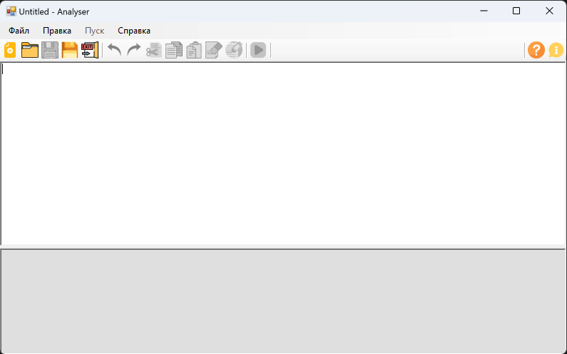
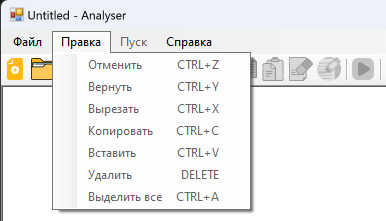

# Лабораторная работа 1. Разработка пользовательского интерфейса (GUI) для языкового процессора

## Цель работы

Создание графического интерфейса пользователя для языкового процессора в виде специализированного текстового редактора.

## Автор

**Костоломов Александр Евгеньевич**
Группа: **АВТ-314**
НГТУ

## Описание проекта

В рамках лабораторной работы разработано оконное приложение, представляющее собой специализированный текстовый редактор.

Программа предназначена для:

* ввода текста;
* редактирования текста;
* открытия и сохранения текстовых файлов;
* последующего расширения до языкового процессора для анализа исходного кода.

В интерфейсе реализованы следующие основные элементы:

* главное меню программы;
* панель инструментов для быстрого доступа к командам;
* область ввода и редактирования текста;
* область вывода результатов работы программы.

## Реализованный функционал

### Меню «Файл»

* **Создать** — создание нового документа;
* **Открыть** — открытие существующего текстового файла;
* **Сохранить** — сохранение текущего документа;
* **Сохранить как** — сохранение документа под новым именем;
* **Выход** — завершение работы программы с подтверждением сохранения изменений.

### Меню «Правка»

* **Отменить** — отмена последнего действия;
* **Повторить** — повтор отменённого действия;
* **Вырезать** — вырезание выделенного текста;
* **Копировать** — копирование выделенного текста;
* **Вставить** — вставка текста из буфера обмена;
* **Удалить** — удаление выделенного фрагмента;
* **Выделить всё** — выделение всего текста в окне редактора.

### Меню «Пуск»

* **Выполнить** — запуск обработки текста.

На текущем этапе языковой процессор ещё не реализован, поэтому команда работает как заглушка и выводит сообщение в нижнюю область результатов.

### Меню «Справка»

* **Справка** — окно с описанием интерфейса и реализованных функций;
* **О программе** — окно с информацией о приложении и авторе.

### Панель инструментов

Основные функции меню продублированы на панели инструментов для быстрого доступа.

## Используемые технологии

* **Язык программирования:** C#
* **Платформа:** .NET Framework 4.8
* **GUI-фреймворк:** Windows Forms
* **Среда разработки:** Microsoft Visual Studio

## Инструкция по сборке и запуску

### Сборка проекта

1. Открыть решение проекта в Microsoft Visual Studio.
2. Выбрать конфигурацию **Release**.
3. Выполнить команду **Сборка → Перестроить решение**.

### Запуск из среды разработки

Для запуска программы в Visual Studio использовать:

* **Отладка → Пуск**
  или клавишу **F5**.

### Запуск готовой программы

После сборки исполняемый файл находится в одной из папок:

* `bin\x86\Release\GUI.exe`
* `bin\Release\GUI.exe`

Точный путь зависит от выбранной платформы сборки.

### Установка на целевой машине

Для запуска программы на компьютере без Visual Studio может использоваться готовый оффлайн-установщик:

* `Analyser_Setup.exe`

Если выполняется запуск напрямую через `GUI.exe`, на компьютере должен быть установлен **.NET Framework 4.8**.

## Руководство пользователя

## Главное окно программы

Главное окно приложения содержит:

* главное меню;
* панель инструментов;
* верхнюю область редактирования текста;
* нижнюю область вывода результатов работы программы.

---

## Меню «Файл»

Меню **«Файл»** предназначено для создания, открытия и сохранения документов.

Команды:

* **Создать**
* **Открыть**
* **Сохранить**
* **Сохранить как**
* **Выход**

Горячие клавиши:

* **Ctrl + N** — создать;
* **Ctrl + O** — открыть;
* **Ctrl + S** — сохранить;
* **Ctrl + Shift + S** — сохранить как;
* **Alt + F4** — выход.

---

## Меню «Правка»

Меню **«Правка»** предназначено для выполнения стандартных операций редактирования текста.

Команды:

* **Отменить**
* **Повторить**
* **Вырезать**
* **Копировать**
* **Вставить**
* **Удалить**
* **Выделить всё**

Горячие клавиши:

* **Ctrl + Z** — отменить;
* **Ctrl + Y** — повторить;
* **Ctrl + X** — вырезать;
* **Ctrl + C** — копировать;
* **Ctrl + V** — вставить;
* **Delete** — удалить;
* **Ctrl + A** — выделить всё.

---

## Подтверждение сохранения изменений

Если пользователь изменил текст и пытается:

* закрыть программу;
* создать новый документ;
* открыть другой файл,

то приложение выводит запрос на сохранение изменений.

---

## Команда «Пуск»

Команда **«Пуск»** запускает обработку текста.

Горячая клавиша:

* **F5** — выполнить.

На текущем этапе в нижней области выводится сообщение о том, что языковой процессор пока не реализован.

---

## Окно «Справка»

Окно **«Справка»** содержит описание интерфейса и перечень реализованных функций программы.

Горячая клавиша:

* **F1** — открыть справку.

---

## Окно «О программе»

Окно **«О программе»** содержит краткие сведения о приложении, авторе и используемой технологии.

## Описание интерфейса

* **Верхняя область** предназначена для ввода и редактирования текста.
* **Нижняя область** предназначена только для вывода результатов работы программы.
* Размеры областей можно изменять с помощью разделителя.
* При изменении размера окна элементы интерфейса автоматически подстраиваются.

## Ограничения

* Приложение разработано для операционной системы **Windows**.
* Для прямого запуска программы требуется установленный **.NET Framework 4.8**.
* На текущем этапе языковой процессор не реализован; команда **«Пуск»** работает как заглушка.
* Дополнительные функции, такие как вкладки, нумерация строк, drag-and-drop, локализация, строка состояния и подсветка синтаксиса, не реализованы.
