# Лабораторная работа 1. Разработка пользовательского интерфейса (GUI) для языкового процессора

## Цель работы

Создание графического интерфейса пользователя для языкового процессора в виде специализированного текстового редактора.

## Автор

**Костоломов Александр Евгеньевич**
Группа: **АВТ-314**
НГТУ

## Описание проекта

В рамках лабораторной работы разработано оконное приложение, представляющее собой специализированный текстовый редактор.

Программа предназначена для:

* ввода текста;
* редактирования текста;
* открытия и сохранения текстовых файлов;
* последующего расширения до языкового процессора для анализа исходного кода.

В интерфейсе реализованы следующие основные элементы:

* главное меню программы;
* панель инструментов для быстрого доступа к командам;
* область ввода и редактирования текста;
* область вывода результатов работы программы.

## Реализованный функционал

### Меню «Файл»

* **Создать** — создание нового документа;
* **Открыть** — открытие существующего текстового файла;
* **Сохранить** — сохранение текущего документа;
* **Сохранить как** — сохранение документа под новым именем;
* **Выход** — завершение работы программы с подтверждением сохранения изменений.

### Меню «Правка»

* **Отменить** — отмена последнего действия;
* **Повторить** — повтор отменённого действия;
* **Вырезать** — вырезание выделенного текста;
* **Копировать** — копирование выделенного текста;
* **Вставить** — вставка текста из буфера обмена;
* **Удалить** — удаление выделенного фрагмента;
* **Выделить всё** — выделение всего текста в окне редактора.

### Меню «Пуск»

* **Выполнить** — запуск обработки текста.

На текущем этапе языковой процессор ещё не реализован, поэтому команда работает как заглушка и выводит сообщение в нижнюю область результатов.

### Меню «Справка»

* **Справка** — окно с описанием интерфейса и реализованных функций;
* **О программе** — окно с информацией о приложении и авторе.

### Панель инструментов

Основные функции меню продублированы на панели инструментов для быстрого доступа.

## Используемые технологии

* **Язык программирования:** C#
* **Платформа:** .NET Framework 4.8
* **GUI-фреймворк:** Windows Forms
* **Среда разработки:** Microsoft Visual Studio

## Инструкция по сборке и запуску

### Сборка проекта

1. Открыть решение проекта в Microsoft Visual Studio.
2. Выбрать конфигурацию **Release**.
3. Выполнить команду **Сборка → Перестроить решение**.

### Запуск из среды разработки

Для запуска программы в Visual Studio использовать:

* **Отладка → Пуск**
  или клавишу **F5**.

### Запуск готовой программы

После сборки исполняемый файл находится в одной из папок:

* `bin\x86\Release\GUI.exe`
* `bin\Release\GUI.exe`

Точный путь зависит от выбранной платформы сборки.

### Установка на целевой машине

Для запуска программы на компьютере без Visual Studio может использоваться готовый оффлайн-установщик:

* `Analyser_Setup.exe`

Если выполняется запуск напрямую через `GUI.exe`, на компьютере должен быть установлен **.NET Framework 4.8**.

## Руководство пользователя

## Главное окно программы

Главное окно приложения содержит:

* главное меню;
* панель инструментов;
* верхнюю область редактирования текста;
* нижнюю область вывода результатов работы программы.

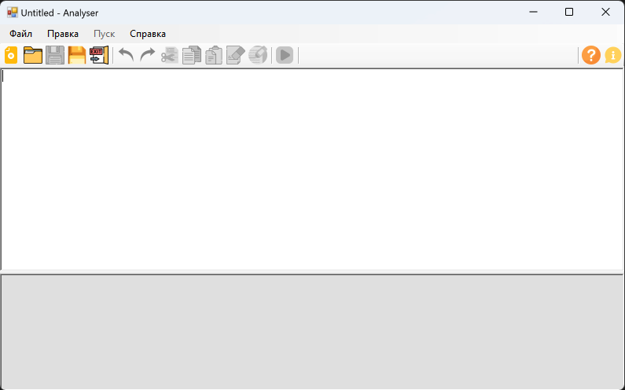

---

## Меню «Файл»

Меню **«Файл»** предназначено для создания, открытия и сохранения документов.

Команды:

* **Создать**
* **Открыть**
* **Сохранить**
* **Сохранить как**
* **Выход**

Горячие клавиши:

* **Ctrl + N** — создать;
* **Ctrl + O** — открыть;
* **Ctrl + S** — сохранить;
* **Ctrl + Shift + S** — сохранить как;
* **Alt + F4** — выход.

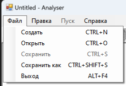

---

## Меню «Правка»

Меню **«Правка»** предназначено для выполнения стандартных операций редактирования текста.

Команды:

* **Отменить**
* **Повторить**
* **Вырезать**
* **Копировать**
* **Вставить**
* **Удалить**
* **Выделить всё**

Горячие клавиши:

* **Ctrl + Z** — отменить;
* **Ctrl + Y** — повторить;
* **Ctrl + X** — вырезать;
* **Ctrl + C** — копировать;
* **Ctrl + V** — вставить;
* **Delete** — удалить;
* **Ctrl + A** — выделить всё.

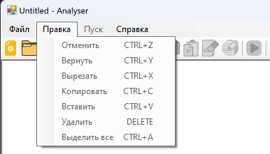

---

## Подтверждение сохранения изменений

Если пользователь изменил текст и пытается:

* закрыть программу;
* создать новый документ;
* открыть другой файл,

то приложение выводит запрос на сохранение изменений.

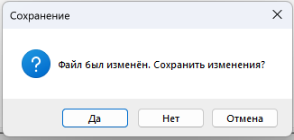

---

## Команда «Пуск»

Команда **«Пуск»** запускает обработку текста.

Горячая клавиша:

* **F5** — выполнить.

На текущем этапе в нижней области выводится сообщение о том, что языковой процессор пока не реализован.

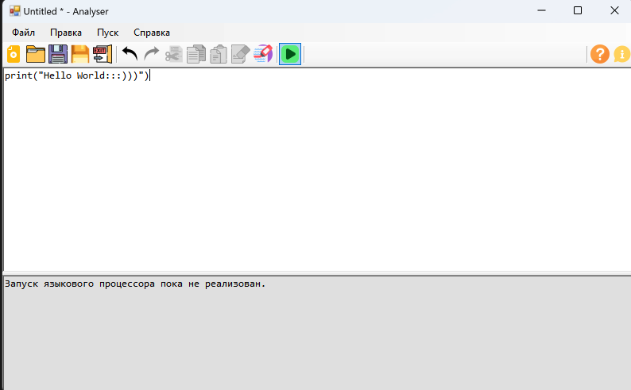

---

## Окно «Справка»

Окно **«Справка»** содержит описание интерфейса и перечень реализованных функций программы.

Горячая клавиша:

* **F1** — открыть справку.

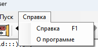

---

## Окно «О программе»

Окно **«О программе»** содержит краткие сведения о приложении, авторе и используемой технологии.

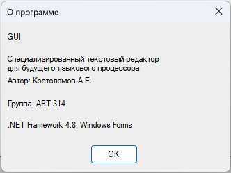

## Описание интерфейса

* **Верхняя область** предназначена для ввода и редактирования текста.
* **Нижняя область** предназначена только для вывода результатов работы программы.
* Размеры областей можно изменять с помощью разделителя.
* При изменении размера окна элементы интерфейса автоматически подстраиваются.

## Ограничения

* Приложение разработано для операционной системы **Windows**.
* Для прямого запуска программы требуется установленный **.NET Framework 4.8**.
* На текущем этапе языковой процессор не реализован; команда **«Пуск»** работает как заглушка.
* Дополнительные функции, такие как вкладки, нумерация строк, drag-and-drop, локализация, строка состояния и подсветка синтаксиса, не реализованы.


---

# Лабораторная работа №2. Разработка лексического анализатора

## Цель работы

Изучить назначение и принципы работы лексического анализатора в структуре компилятора. Спроектировать диаграмму состояний конечного автомата и выполнить программную реализацию сканера для выделения лексем из входного текста. Интегрировать разработанный модуль в ранее созданный графический интерфейс языкового процессора.

## Постановка задачи
В рамках лабораторной работы требовалось:

1. Разработать диаграмму состояний сканера.
2. Реализовать лексический анализатор для выделения лексем входной строки.
3. Выполнить классификацию лексем и вывести результат в таблицу.
4. Реализовать переход к позиции лексемы в редакторе по щелчку на строке таблицы.
5. Интегрировать сканер в графический интерфейс, разработанный в лабораторной работе №1.

## Вариант задания
**Объявление списка с инициализацией на языке Kotlin**

Пример корректной строки:

```kotlin
val animals = listOf("Dog", "Cat", "Cow");
```

## Поддерживаемые лексемы
В программе распознаются следующие типы лексем:

- ключевое слово `val`;
- идентификатор;
- оператор присваивания `=`;
- специальная лексема `listOf`;
- открывающая круглая скобка `(`;
- закрывающая круглая скобка `)`;
- разделитель `,`;
- конец оператора `;`;
- строковый литерал;
- целочисленный литерал;
- вещественный литерал;
- логические литералы `true`, `false`;
- знаки `+` и `-`.

## Диаграмма состояний

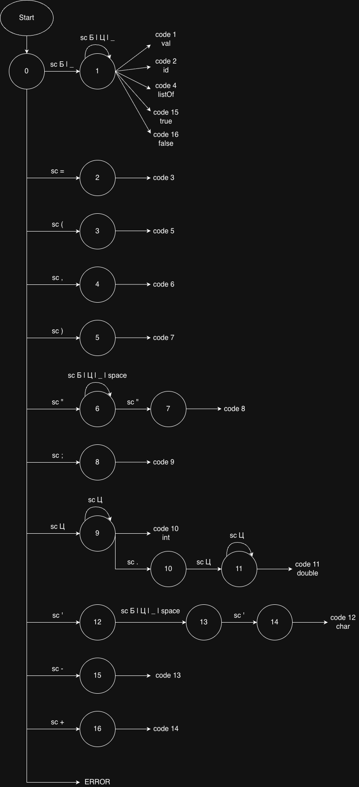

## Результат лексического анализа
Для каждой найденной лексемы в таблице отображаются:

- условный код;
- тип лексемы;
- лексема / сообщение;
- местоположение (строка, начальный и конечный столбцы).

При выборе строки в таблице курсор в редакторе переходит к соответствующей позиции.

## Пример корректного ввода
Исходная строка:

```kotlin
val animals = listOf("Dog", "Cat", "Cow");
```

Результат работы программы:


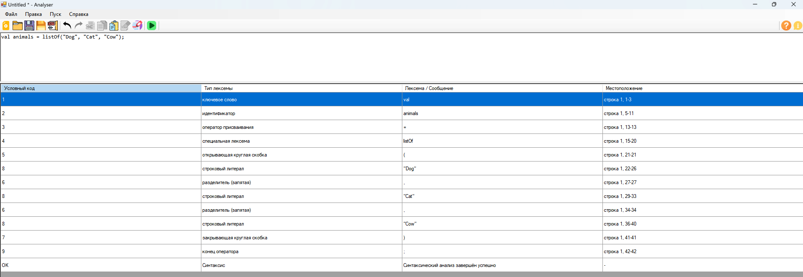

## Примеры ошибочного ввода

### Пропущен символ `;`
```kotlin
val animals = listOf("Dog", "Cat", "Cow")
```


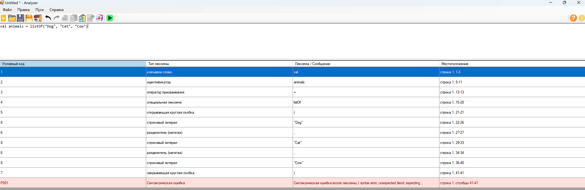

### Лишняя запятая
```kotlin
val animals = listOf("Dog", , "Cow");
```


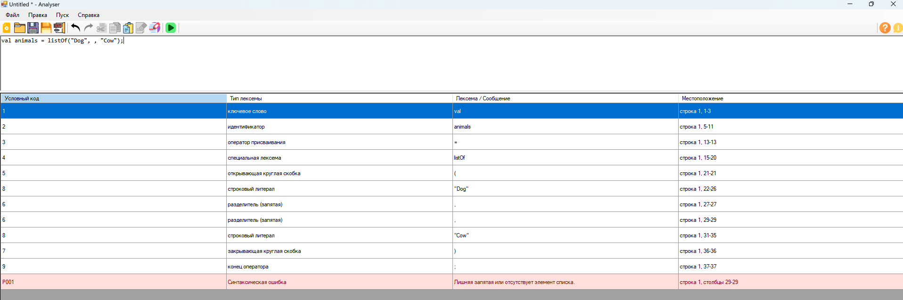

### Запятая перед закрывающей скобкой
```kotlin
val animals = listOf("Dog", "Cat", );
```


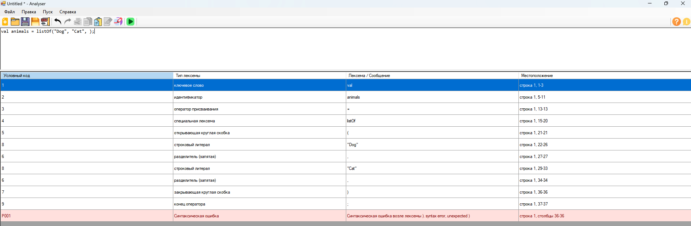

---

# Дополнительное задание. Интеграция Flex & Bison

## Содержание дополнительного задания
В рамках дополнительного задания требовалось:

1. Разработать грамматику.
2. Сгенерировать код лексера и парсера для анализа грамматики с помощью программного обеспечения FLEX & BISON.
3. Внедрить и протестировать полученный анализатор в программе, реализованной в рамках первой лабораторной работы.
4. Дополнить README грамматиками, классификацией грамматики, примерами допустимых строк и тестовыми примерами.

## Что было реализовано
В ходе выполнения дополнительного задания:

- разработана формальная грамматика конструкции объявления списка с инициализацией на языке Kotlin;
- созданы файлы `lexer.l` и `parser.y`;
- сгенерирован код лексического и синтаксического анализаторов;
- реализован нативный модуль `NativeParser.dll`;
- выполнено подключение нативного парсера к Windows Forms приложению на C#;
- синтаксический анализ запускается после успешного завершения лексического анализа;
- результат синтаксического анализа выводится в общей таблице вместе с лексическим разбором.

## Разработанная грамматика

Обозначим грамматику как:

```text
G[Z] = {Vt, Vn, Z, P}
```

### Терминальные символы `Vt`

```text
Vt = {
val, listOf, identifier, string, int, double, true, false,
(, ), ,, ;, =, +, -
}
```

### Нетерминальные символы `Vn`

```text
Vn = {
<program>,
<statement>,
<elements>,
<element>,
<signed_number>
}
```

### Начальный символ

```text
Z = <program>
```

### Правила продукции `P`

```text
<program> ::= <statement>

<statement> ::= val identifier = listOf ( <elements> ) ;

<elements> ::= <element>
             | <elements> , <element>

<element> ::= string
            | true
            | false
            | <signed_number>

<signed_number> ::= int
                  | double
                  | + int
                  | - int
                  | + double
                  | - double
```

## Грамматика в представлении Flex & Bison

### Токены

```text
VAL
LISTOF
IDENTIFIER
STRING
INT
DOUBLE
TRUE
FALSE
LPAREN
RPAREN
COMMA
SEMICOLON
ASSIGN
PLUS
MINUS
INVALID
```

### Правила синтаксического анализа

```text
program
    : statement
    ;

statement
    : VAL IDENTIFIER ASSIGN LISTOF LPAREN elements RPAREN SEMICOLON
    ;

elements
    : element
    | elements COMMA element
    ;

element
    : STRING
    | TRUE
    | FALSE
    | signed_number
    ;

signed_number
    : INT
    | DOUBLE
    | PLUS INT
    | MINUS INT
    | PLUS DOUBLE
    | MINUS DOUBLE
    ;
```

## Классификация грамматики
Данная грамматика является **контекстно-свободной**, так как в левой части каждого правила находится ровно один нетерминальный символ.

Для синтаксического анализа использован восходящий анализ, реализуемый генератором парсеров **Bison**.  
Для лексического анализа использован генератор сканеров **Flex**.

## Архитектура решения
В проект были добавлены следующие компоненты:

- `lexer.l` — описание правил лексического анализа для Flex;
- `parser.y` — описание грамматики для Bison;
- `wrapper.c` — прослойка между нативным парсером и C# приложением;
- `NativeParser.dll` — собранная библиотека синтаксического анализа;
- `NativeParserInterop.cs` — C#-обёртка для вызова DLL;
- модифицированный `MainForm.cs` — запуск синтаксического анализа после лексического.

При успешном завершении лексического анализа вызывается функция `ParseSourceCode(...)` из `NativeParser.dll`.  
Если в строке обнаруживается синтаксическая ошибка, в таблицу добавляется отдельная строка с сообщением об ошибке и координатами.

## Интеграция Flex & Bison
Синтаксический анализатор был собран как отдельный нативный модуль и подключён к Windows Forms приложению.


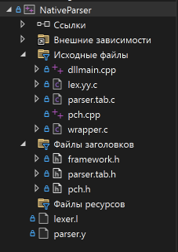

## Переход к позиции ошибки
При выборе строки таблицы с лексемой курсор в редакторе переходит к позиции найденной лексемы.  
При выборе строки с синтаксической ошибкой выполняется переход к диапазону позиции ошибки и её подсветка в редакторе.


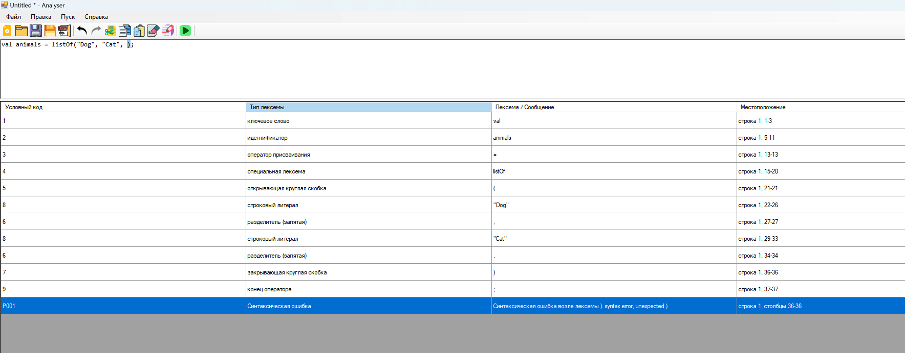

## Примеры допустимых строк

```kotlin
val animals = listOf("Dog", "Cat", "Cow");
val nums = listOf(1, 2, 3);
val nums2 = listOf(-1, +2, 3.14);
val flags = listOf(true, false, true);
```

## Тестовые примеры

### Корректный пример
```kotlin
val animals = listOf("Dog", "Cat", "Cow");
```

Ожидаемый результат:

- лексический анализ проходит успешно;
- синтаксический анализ проходит успешно;
- в таблице отображается строка `OK`.

### Ошибочные примеры

#### 1. Пропущен `;`
```kotlin
val animals = listOf("Dog", "Cat", "Cow")
```

#### 2. Лишняя запятая
```kotlin
val animals = listOf("Dog", , "Cow");
```

#### 3. Запятая перед `)`
```kotlin
val animals = listOf("Dog", "Cat", );
```

#### 4. Отсутствует элемент после `(`
```kotlin
val animals = listOf(, "Dog");
```

#### 5. Отсутствует запятая между элементами
```kotlin
val animals = listOf("Dog" "Cat");
```

## Инструкция по сборке дополнительного задания

### Требования

- Windows;
- Microsoft Visual Studio;
- .NET Framework 4.8;
- WinFlexBison.

### Сборка

1. Открыть решение в Visual Studio.
2. Выбрать конфигурацию `Debug` или `Release`.
3. Для GUI-проекта выбрать платформу `x86`.
4. Для проекта `NativeParser` выбрать платформу `Win32`.
5. Сгенерировать файлы `parser.tab.c`, `parser.tab.h`, `lex.yy.c`.
6. Собрать проект `NativeParser`.
7. Убедиться, что `NativeParser.dll` располагается рядом с `GUI.exe`.
8. Выполнить сборку основного GUI-проекта.

## Вывод
В ходе лабораторной работы был реализован лексический анализатор для конструкции объявления списка с инициализацией на языке Kotlin и выполнена его интеграция в графический интерфейс языкового процессора.

В рамках дополнительного задания была разработана контекстно-свободная грамматика, реализован синтаксический анализатор на основе Flex & Bison и выполнено его подключение к основному приложению. Программа позволяет выполнять как лексический, так и синтаксический анализ входной строки, выводить диагностические сообщения и переходить к позиции найденной ошибки.


---

# Лабораторная работа №3. Разработка синтаксического анализатора (парсера)

## 1. Название и цель лабораторной работы

**Лабораторная работа №3. Разработка синтаксического анализатора (парсера)**

Цель работы — изучить назначение и принципы работы синтаксического анализатора в структуре компилятора, спроектировать грамматику для заданной синтаксической конструкции, выбрать и обосновать метод анализа, выполнить программную реализацию парсера с нейтрализацией синтаксических ошибок методом Айронса и интегрировать разработанный модуль в ранее созданный графический интерфейс языкового процессора.

## 2. Сведения об авторе

**Костоломов Александр Евгеньевич**  
Группа: **АВТ-314**  
НГТУ

## 3. Постановка задачи

В рамках лабораторной работы требовалось:

1. Разработать синтаксический анализатор для заданной синтаксической конструкции
2. Интегрировать парсер в приложение, разработанное в лабораторной работе №1
3. Выполнять синтаксический анализ после успешного завершения лексического анализа из лабораторной работы №2
4. Выводить результаты анализа в таблицу ошибок
5. Реализовать переход к месту ошибки в редакторе по щелчку на строке таблицы
6. Реализовать нейтрализацию синтаксических ошибок методом Айронса
7. Подготовить тестовые примеры корректного и ошибочного ввода

## 4. Вариант задания

**Вариант:** Объявление списка с инициализацией на языке Kotlin

### Примеры корректных строк

```kotlin
val animals = listOf("Dog", "Cat", "Cow");
val nums = listOf(1, -2, +3.5, 0);
val flags = listOf(true, false, true);
val letters = listOf('a', 'b', 'c');
val empty = listOf();
```

### Поддерживаемые элементы списка

Парсер поддерживает следующие типы элементов:

- строковый литерал
- символьный литерал
- целочисленный литерал
- вещественный литерал
- логические литералы `true`, `false`
- числа со знаком `+` и `-`
- пустой список

### Допустимые лексемы

В синтаксической конструкции используются следующие лексемы:

- ключевое слово `val`
- идентификатор
- оператор присваивания `=`
- специальная лексема `listOf`
- открывающая круглая скобка `(`
- закрывающая круглая скобка `)`
- разделитель `,`
- конец оператора `;`
- строковый литерал
- символьный литерал
- целочисленный литерал
- вещественный литерал
- логические литералы `true`, `false`
- знаки `+` и `-`

## 5. Разработка грамматики

Синтаксическая конструкция объявления списка с инициализацией на языке Kotlin описывается контекстно-свободной грамматикой.

Формально контекстно-свободная грамматика задаётся как:

```text
G[Z] = {V_T, V_N, Z, P}
```

где  
`V_T` — множество терминальных символов  
`V_N` — множество нетерминальных символов  
`Z` — начальный символ грамматики  
`P` — множество правил продукции, причём для контекстно-свободной грамматики каждое правило имеет вид

```text
A -> α
```

где `A ∈ V_N`, `α ∈ (V_T ∪ V_N)*`

### Терминальные символы

```text
V_T = {
"val", "listOf", "true", "false", "=", "(", ")", ",", ";", "+", "-", ".", "\"", "'", "_", " ",
"A"..."Z", "a"..."z", "0"..."9"
}
```

### Нетерминальные символы

```text
V_N = {
Z,
<declaration>,
<elements_opt>,
<elements>,
<element>,
<number>,
<signed_number>,
<sign>,
<identifier>,
<identifier_tail>,
<string>,
<string_body>,
<string_char>,
<char>,
<char_symbol>,
<int>,
<double>,
<digits>,
<digit>,
<letter>
}
```

### Начальный символ

```text
Z = <declaration>
```

### Правила продукции

```text
<declaration> -> "val" <identifier> "=" "listOf" "(" <elements_opt> ")" ";"

<elements_opt> -> <elements>
<elements_opt> -> ε

<elements> -> <element>
<elements> -> <element> "," <elements>

<element> -> <string>
<element> -> <char>
<element> -> "true"
<element> -> "false"
<element> -> <number>

<number> -> <int>
<number> -> <double>
<number> -> <signed_number>

<signed_number> -> <sign> <int>
<signed_number> -> <sign> <double>

<sign> -> "+"
<sign> -> "-"

<identifier> -> <letter> <identifier_tail>
<identifier> -> "_" <identifier_tail>

<identifier_tail> -> <letter> <identifier_tail>
<identifier_tail> -> <digit> <identifier_tail>
<identifier_tail> -> "_" <identifier_tail>
<identifier_tail> -> ε

<string> -> "\"" <string_body> "\""

<string_body> -> <string_char> <string_body>
<string_body> -> ε

<string_char> -> <letter>
<string_char> -> <digit>
<string_char> -> "_"
<string_char> -> " "

<char> -> "'" <char_symbol> "'"

<char_symbol> -> <letter>
<char_symbol> -> <digit>
<char_symbol> -> "_"
<char_symbol> -> " "

<int> -> <digit> <digits>

<double> -> <digit> <digits> "." <digit> <digits>

<digits> -> <digit> <digits>
<digits> -> ε

<digit> -> "0"
<digit> -> "1"
<digit> -> "2"
<digit> -> "3"
<digit> -> "4"
<digit> -> "5"
<digit> -> "6"
<digit> -> "7"
<digit> -> "8"
<digit> -> "9"

<letter> -> "A" | "B" | ... | "Z" | "a" | "b" | ... | "z"
```

## 6. Классификация грамматики по Хомскому

Разработанная грамматика относится к **контекстно-свободным грамматикам**, то есть к **грамматикам второго типа** по классификации Хомского.

Это объясняется тем, что в левой части каждого правила продукции находится ровно один нетерминальный символ, а правая часть может содержать произвольную последовательность терминальных и нетерминальных символов.

Следовательно, данная грамматика имеет вид:

```text
A -> α, где A ∈ V_N, α ∈ (V_T ∪ V_N)*
```

что соответствует определению контекстно-свободной грамматики.

## 7. Метод анализа

Для синтаксического анализа в лабораторной работе выбран метод **рекурсивного спуска**.

Выбор данного метода обусловлен тем, что синтаксическая конструкция варианта имеет последовательную и иерархическую структуру: сначала распознаются обязательные элементы объявления, затем выполняется разбор содержимого списка, после чего проверяется корректность завершения всей конструкции. Такой подход удобно реализуется на языке C# и позволяет встраивать диагностику ошибок непосредственно в процедуры анализа.

В разработанном парсере разбор строится поэтапно и соответствует логике корректной входной строки вида:

```kotlin
val animals = listOf("Dog", "Cat", "Cow");
```

Сначала анализатор последовательно проверяет:

- ключевое слово `val`;
- идентификатор;
- оператор присваивания `=`;
- функцию инициализации списка `listOf`;
- открывающую круглую скобку `(`.

После этого начинается разбор содержимого списка. На данном этапе допускаются два варианта:

1. **пустой список** — сразу встречается символ `)`;
2. **непустой список** — считывается первый элемент списка.

Если список непустой, анализатор разбирает один элемент и затем проверяет, следует ли после него запятая. Если запятая присутствует, выполняется переход к разбору следующего элемента. Таким образом, процедура повторяется циклически до тех пор, пока не будет достигнут конец списка.

Элементами списка в реализованном варианте могут быть:

- строковые литералы;
- символьные литералы;
- логические литералы `true` и `false`;
- целочисленные и вещественные литералы;
- числа со знаком `+` или `-`.

После завершения разбора списка анализатор ожидает закрывающую круглую скобку `)` и символ конца оператора `;`. Только после успешной проверки этих элементов конструкция считается синтаксически корректной.

В программной реализации данная логика поддерживается набором взаимосвязанных процедур рекурсивного спуска. Основной разбор объявления выполняется процедурой `ParseDeclaration()`, разбор пустого или непустого списка — `ParseElementsOpt()`, последовательности элементов — `ParseElements()`, отдельного элемента — `ParseElement()`. Для числовых литералов дополнительно используются процедуры `ParseNumberLiteral()`, `ParseSignedNumber()` и `ParseSign()`.

### Схема метода анализа

Ниже приведена схема метода анализа для выбранной синтаксической конструкции.

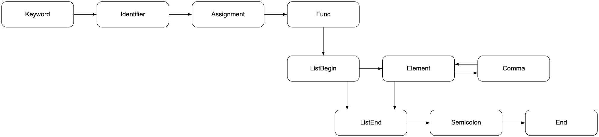

На схеме показан общий ход рекурсивного спуска при разборе объявления списка с инициализацией на языке Kotlin. После распознавания ключевого слова, идентификатора, оператора присваивания и функции `listOf` анализатор переходит к разбору списка. Далее допускается либо немедленное завершение списка, либо разбор первого элемента. После каждого элемента проверяется наличие запятой: если она есть, начинается разбор следующего элемента; если её нет, выполняется переход к завершению списка. Завершается разбор проверкой символов `)` и `;`.

### Программная реализация метода анализа

В проект были добавлены следующие классы:

- `SyntaxAnalyzer.cs` — основной синтаксический анализатор
- `SyntaxResult.cs` — результат синтаксического анализа
- `SyntaxError.cs` — описание одной синтаксической ошибки
- `SyntaxTokenStream.cs` — вспомогательный класс для пошагового обхода потока лексем

Парсер работает поверх результата лексического анализа. После нажатия кнопки **«Пуск»** сначала запускается лексический анализатор. Если лексические ошибки отсутствуют, результат передаётся в синтаксический анализатор. После этого выполняется разбор последовательности лексем по правилам заданной грамматики, а информация об ошибках выводится в таблицу результатов.

## 8. Диагностика и нейтрализация синтаксических ошибок

В программе реализована нейтрализация синтаксических ошибок методом **Айронса**.

Суть метода в данной лабораторной работе заключается в следующем:

1. При обнаружении ошибки парсер не завершает работу немедленно
2. Выполняется поиск ближайшей точки синхронизации
3. После достижения синхронизирующего символа разбор продолжается
4. Благодаря этому в одном запуске можно обнаружить несколько ошибок

### Используемые точки синхронизации

В реализации парсера в качестве точек синхронизации используются:

- `val` — начало нового объявления
- `,` — разделитель элементов списка
- `)` — завершение списка
- `;` — завершение оператора

Дополнительно в реализации учитываются границы строк, чтобы одна полностью ошибочная строка не вызывала каскад большого количества вторичных ошибок.

### Примеры диагностируемых ошибок

Парсер обнаруживает, в частности, следующие типы ошибок:

- отсутствует ключевое слово `val`
- отсутствует идентификатор после `val`
- отсутствует оператор присваивания `=`
- отсутствует лексема `listOf`
- отсутствует открывающая или закрывающая круглая скобка
- отсутствует `;` в конце объявления
- отсутствует запятая между элементами списка
- присутствует лишняя запятая
- элемент списка имеет недопустимый вид
- после знака `+` или `-` отсутствует число

### Интеграция в графический интерфейс

Парсер встроен в приложение из лабораторной работы №1.

Реализованы следующие возможности:

- запуск синтаксического анализа из интерфейса
- вывод найденных ошибок в таблицу
- отображение неверного фрагмента, позиции и описания ошибки
- вывод общего количества ошибок
- переход к месту ошибки в редакторе по щелчку на строке таблицы
- подсветка ошибочного фрагмента в текстовом поле

### Дополнительное задание. Интеграция ANTLR

В рамках дополнительного задания была реализована альтернативная версия синтаксического анализатора с использованием **ANTLR**.

Выполнено следующее:

- разработана грамматика `KotlinList.g4`
- сгенерированы классы лексера и парсера ANTLR для C#
- подключён runtime `Antlr4.Runtime.Standard`
- реализован запуск ANTLR-анализа из графического интерфейса
- результаты ANTLR-анализа выводятся в таблицу ошибок

Дополнительная реализация позволяет сравнить ручной синтаксический анализатор на основе рекурсивного спуска и автоматически сгенерированный синтаксический анализатор на основе ANTLR.

## 9. Тестовые примеры

### 1. Корректный ввод

```kotlin
val animals = listOf("Dog", "Cat", "Cow");
```

Результат: ошибок не обнаружено.

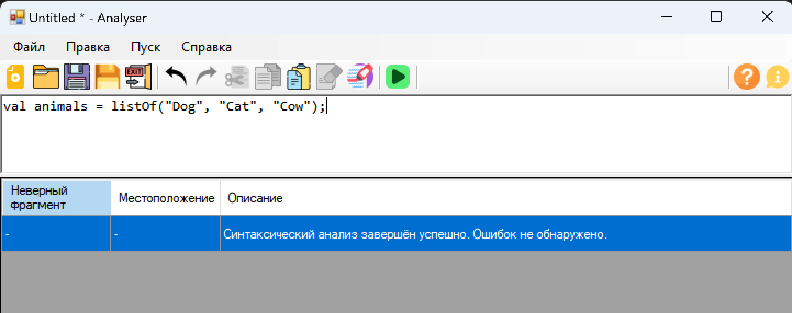

### 2. Отсутствует `val`

```kotlin
animals = listOf("Dog");
```

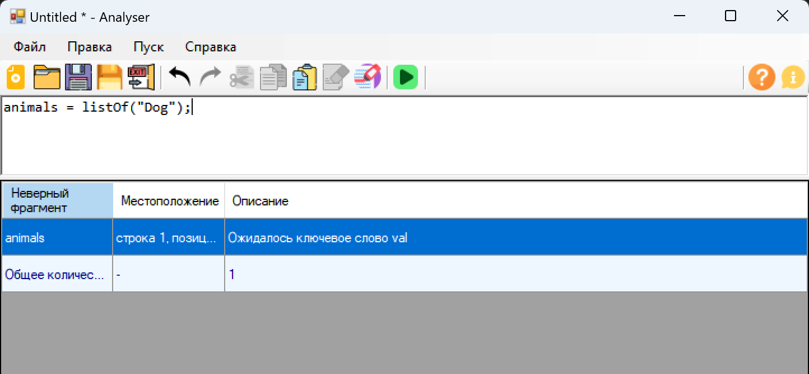

### 3. Отсутствует идентификатор

```kotlin
val = listOf("Dog");
```

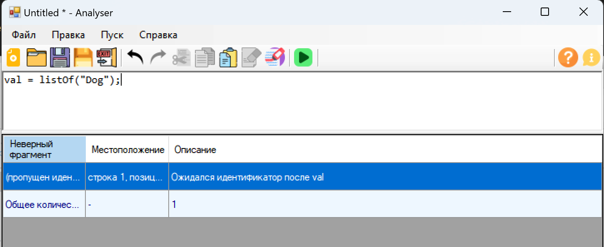

### 4. Пропущена запятая между элементами

```kotlin
val animals = listOf("Dog" "Cat");
```

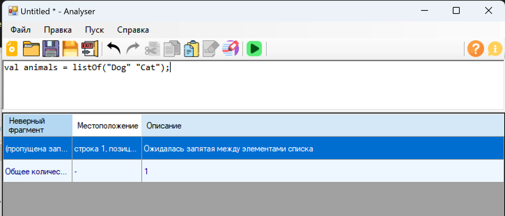

### 5. Некорректный элемент списка

```kotlin
val animals = listOf("Dog", qwerty, "Cat");
```

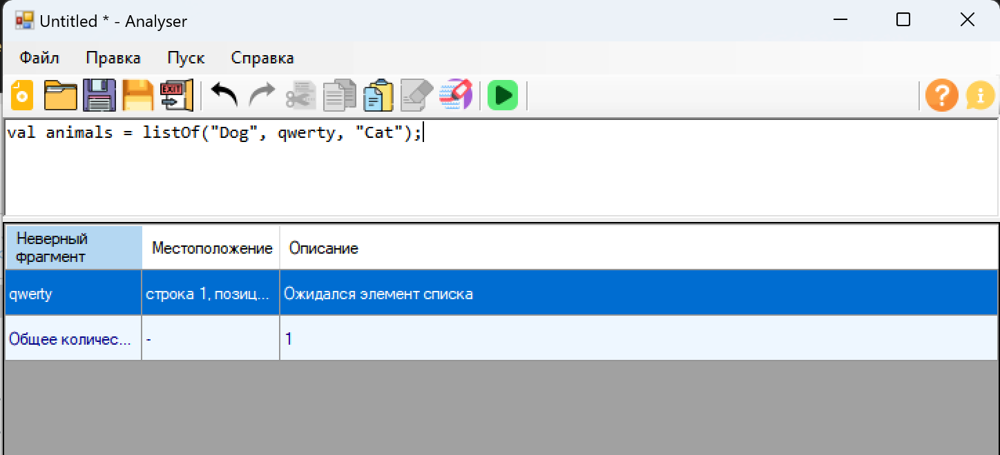

### 6. Несколько ошибок в одной строке

```kotlin
val = listOf(+, , "Dog" true ;
```

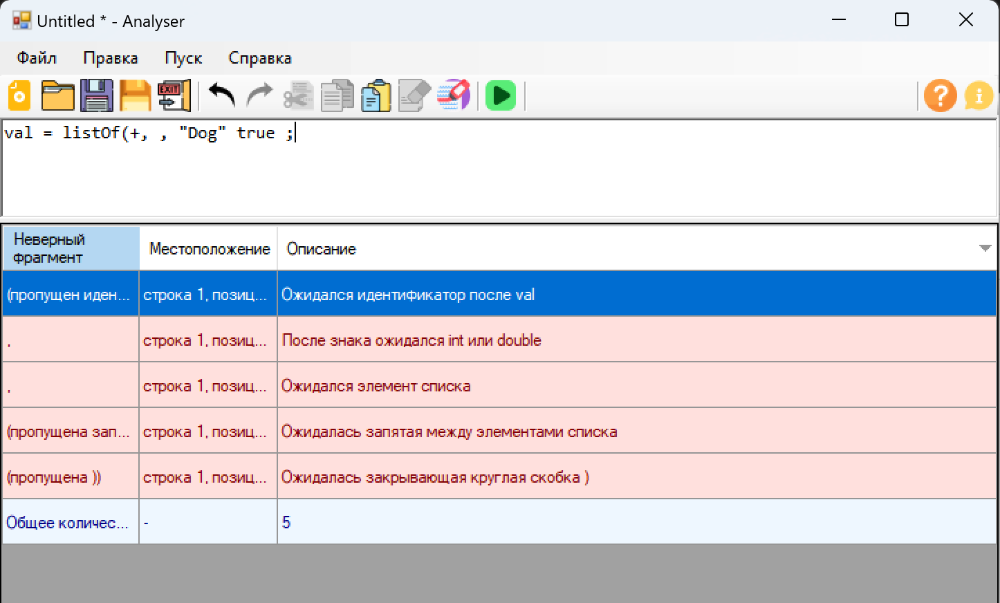

### 7. Мусорные строки и восстановление разбора

```text
qwerty
asdf
val animals = listOf("Dog", "Cat");
```

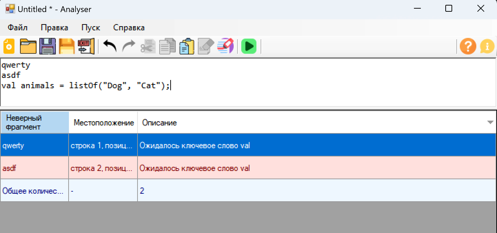

### 8. Навигация к ошибке

При щелчке по строке таблицы курсор в редакторе переходит к ошибочному фрагменту и выделяет его.

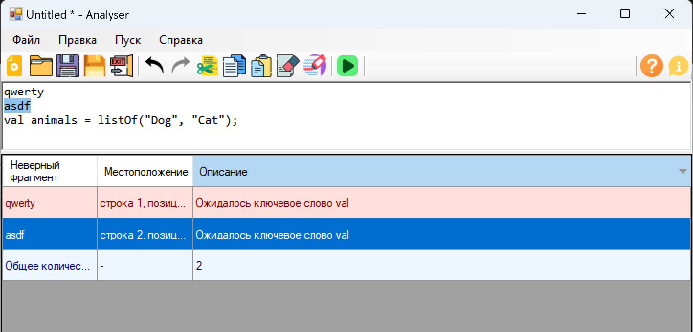

### 9. Дополнительное задание: корректный запуск ANTLR

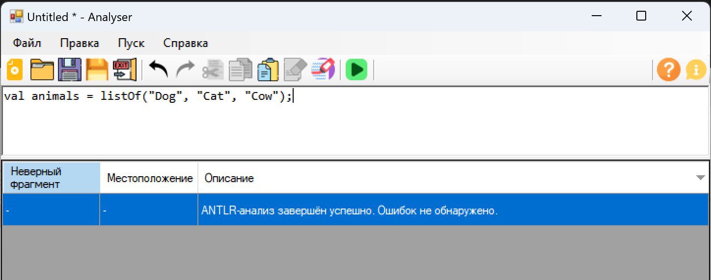

### 10. Дополнительное задание: ошибка ANTLR

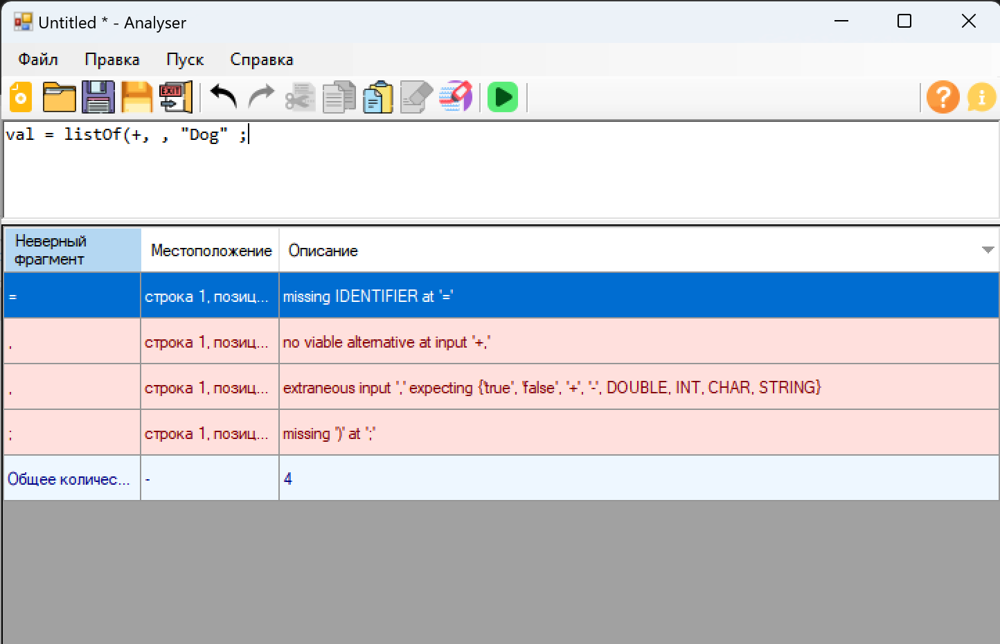

## Вывод

В ходе лабораторной работы был разработан синтаксический анализатор для конструкции объявления списка с инициализацией на языке Kotlin.

Выполнено:

- разработана контекстно-свободная грамматика
- выбран и реализован метод рекурсивного спуска
- реализована нейтрализация синтаксических ошибок методом Айронса
- парсер интегрирован в графический интерфейс
- реализован вывод ошибок в таблицу и переход к месту ошибки
- проведено тестирование на корректных и ошибочных примерах
- дополнительно реализована альтернативная версия синтаксического анализатора на основе ANTLR

Разработанная программа позволяет выполнять как лексический, так и синтаксический анализ входного текста и наглядно отображать результаты разбора.