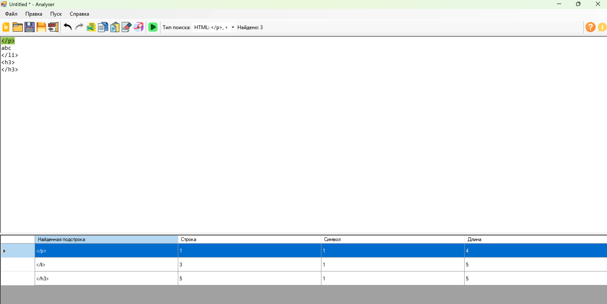
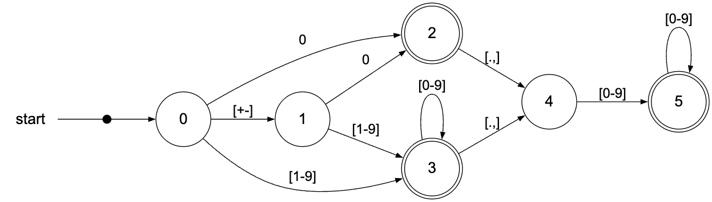
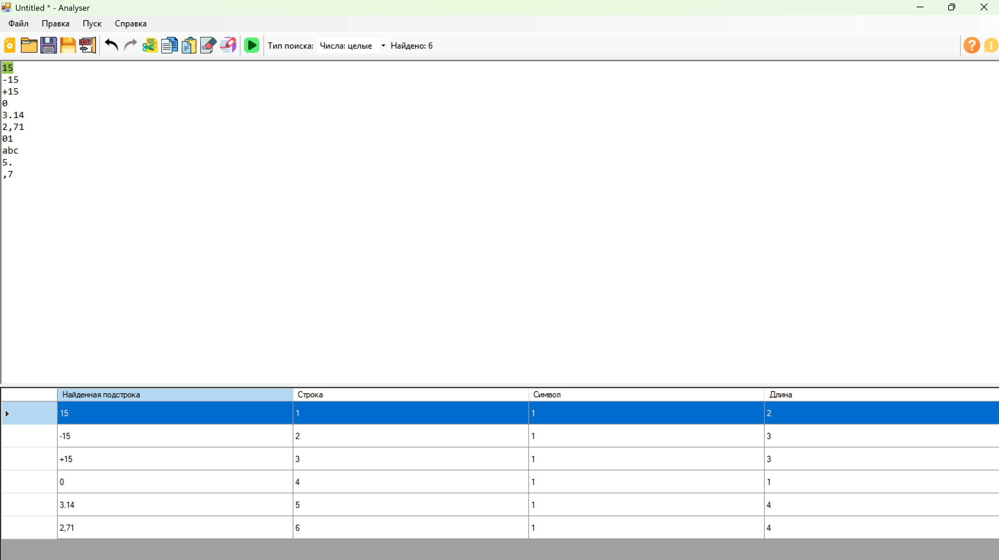
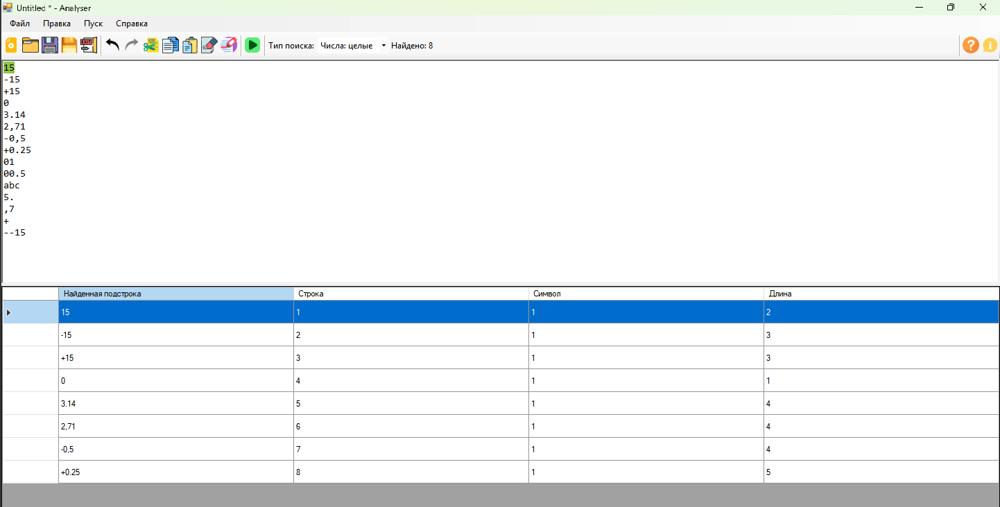
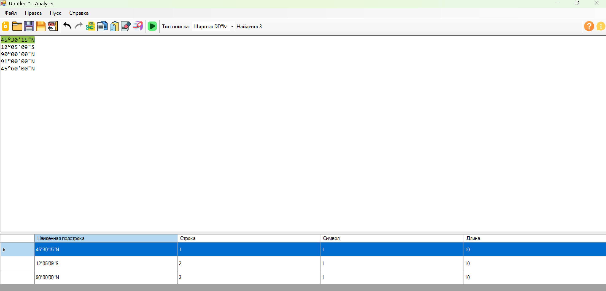

# Лабораторная работа 4. Реализация алгоритма поиска подстрок с помощью регулярных выражений

## Цель работы

Изучить теоретические основы регулярных выражений и их применение для поиска и извлечения подстрок из текста. Освоить практические навыки использования библиотечных средств работы с регулярными выражениями, а также интеграцию алгоритмов поиска в графический интерфейс приложения.

## Автор

**Костоломов Александр Евгеньевич**  
Группа: **АВТ-314**  
НГТУ

## Постановка задачи

Необходимо доработать существующее приложение-текстовый редактор, созданное в рамках лабораторной работы 1, и реализовать в нём поиск подстрок по регулярным выражениям.

В соответствии с индивидуальным вариантом требуется решить три задачи:

1. Построить регулярное выражение для поиска закрывающих HTML-тегов `</p>`, `</li>`, `</h3>`.
2. Построить регулярное выражение, описывающее положительные и отрицательные целые числа и числа с плавающей точкой с разделителями `.` и `,`.
3. Построить регулярное выражение, описывающее широту в формате `градусы/минуты/секунды`, например `45°30'15"N`, с учётом корректных диапазонов значений.

Дополнительно реализовано бонусное задание: для задачи 2 алгоритм поиска подстрок выполнен не только на основе регулярного выражения, но и через граф конечного автомата с посимвольным анализом входного текста.

## Краткое описание программы

Программа представляет собой специализированный текстовый редактор с возможностью поиска подстрок по выбранному шаблону.

Реализованы следующие возможности:

- ввод и редактирование текста;
- открытие и сохранение текстовых файлов;
- выбор типа поиска через выпадающий список;
- запуск анализа по команде **Пуск** или клавише **F5**;
- вывод найденных совпадений в таблицу;
- отображение количества найденных совпадений;
- подсветка найденной подстроки в тексте при выборе строки в таблице результатов.

## Используемые технологии

- **Язык программирования:** C#;
- **Платформа:** .NET Framework 4.8;
- **GUI-фреймворк:** Windows Forms;
- **Среда разработки:** Microsoft Visual Studio.

## Решение задачи 1. Поиск закрывающих HTML-тегов

### Описание задачи

Требуется находить в тексте только следующие закрывающие HTML-теги:

- `</p>`
- `</li>`
- `</h3>`

### Регулярное выражение

Для поиска в тексте используется следующее регулярное выражение:

```regex
</(?:p|li|h3)>
```

### Пояснение регулярного выражения

- `</` — буквальная последовательность символов `</`;
- `(?: ... )` — незахватывающая группа;
- `p|li|h3` — один из трёх допустимых вариантов;
- `>` — закрывающая угловая скобка.

### Примеры строк, которые должны находиться

- `</p>`
- `</li>`
- `</h3>`

### Примеры строк, которые не должны находиться

- `<p>`
- `<li>`
- `</h4>`
- `</p`
- `< /p >`

### Тестовый пример

На рисунке ниже показан пример поиска закрывающих HTML-тегов в тексте.



---

## Решение задачи 2. Поиск целых и вещественных чисел

### Описание задачи

Требуется находить в тексте:

- положительные целые числа;
- отрицательные целые числа;
- положительные вещественные числа;
- отрицательные вещественные числа;
- число `0`.

Допускаются два разделителя дробной части: `.` и `,`.

### Регулярное выражение

Регулярное выражение, описывающее данный класс чисел:

```regex
(?<![\w.,+-])[+-]?(?:0|[1-9]\d*)(?:[.,]\d+)?(?![\w.,])
```

### Пояснение регулярного выражения

- `(?<![\w.,+-])` — слева не должно быть буквы, цифры, символа `_`, знаков `.` `,` `+` `-`;
- `[+-]?` — необязательный знак числа;
- `(?:0|[1-9]\d*)` — либо число `0`, либо целая часть без ведущих нулей;
- `(?:[.,]\d+)?` — необязательная дробная часть с разделителем `.` или `,`;
- `(?![\w.,])` — справа не должно быть буквы, цифры, символа `_`, знаков `.` или `,`.

### Примеры строк, которые должны находиться

- `15`
- `-15`
- `+15`
- `0`
- `3.14`
- `2,71`
- `-0,5`
- `+0.25`

### Примеры строк, которые не должны находиться

- `abc`
- `5.`
- `,7`
- `01`
- `00.5`
- `+`
- `--15`

### Реализация дополнительного задания через конечный автомат

Для задачи 2 дополнительно реализован алгоритм поиска чисел через граф конечного автомата.

В программе используется посимвольный анализ текста. Автомат последовательно переходит между состояниями в зависимости от текущего символа:

- начальное состояние;
- чтение знака числа;
- чтение нуля;
- чтение целой части;
- чтение разделителя дробной части;
- чтение дробной части.

Допускающими являются состояния, соответствующие корректно распознанному числу:

- `0`;
- целому числу без ведущих нулей;
- вещественному числу с дробной частью.

Таким образом, для дополнительного задания поиск подстрок в задаче 2 выполняется через автомат, а результаты поиска выводятся в ту же таблицу с указанием найденной подстроки, строки, позиции и длины.

### Граф автомата для задачи 2

Ниже приведён граф конечного автомата, используемого для поиска чисел.



### Тестовый пример для поиска чисел регулярным выражением

На рисунке ниже приведён пример поиска чисел в тексте.



### Тестовый пример для поиска чисел с помощью автомата

На рисунке ниже приведён пример поиска чисел, реализованного через конечный автомат.



---

## Решение задачи 3. Поиск широты в формате DD°MM'SS"N/S

### Описание задачи

Требуется находить широту в формате:

```text
45°30'15"N
```

Необходимо учитывать корректные диапазоны значений:

- градусы: от `0` до `90`;
- минуты: от `00` до `59`;
- секунды: от `00` до `59`;
- направление: `N` или `S`.

При этом значение `90` градусов допускается только в виде:

- `90°00'00"N`
- `90°00'00"S`

### Регулярное выражение

Для поиска в тексте используется следующее регулярное выражение:

```regex
(?<!\w)(?:(?:[0-8]?\d)°(?:[0-5]\d)'(?:[0-5]\d)"[NS]|90°00'00"[NS])(?!\w)
```

### Пояснение регулярного выражения

- `(?<!\w)` — слева не должно быть буквы, цифры или `_`;
- `(?:[0-8]?\d)` — градусы от `0` до `89`;
- `°` — символ градусов;
- `(?:[0-5]\d)` — минуты от `00` до `59`;
- `'` — символ минут;
- `(?:[0-5]\d)` — секунды от `00` до `59`;
- `"` — символ секунд;
- `[NS]` — направление `N` или `S`;
- `|90°00'00"[NS]` — отдельная проверка граничного значения `90°00'00"N/S`;
- `(?!\w)` — справа не должно быть буквы, цифры или `_`.

### Примеры строк, которые должны находиться

- `45°30'15"N`
- `12°05'09"S`
- `0°00'00"N`
- `89°59'59"S`
- `90°00'00"N`
- `90°00'00"S`

### Примеры строк, которые не должны находиться

- `91°00'00"N`
- `45°60'00"N`
- `45°30'60"N`
- `90°10'00"N`
- `90°00'01"S`

### Тестовый пример

На рисунке ниже приведён пример поиска широты в тексте.



---

## Описание интерфейса

Главное окно программы содержит:

- главное меню;
- панель инструментов;
- верхнюю область редактирования текста;
- нижнюю область таблицы результатов поиска.

После запуска поиска программа:

1. анализирует текст по выбранному шаблону;
2. формирует список найденных совпадений;
3. выводит найденные подстроки в таблицу;
4. отображает номер строки, номер символа и длину каждой найденной подстроки;
5. показывает общее количество найденных совпадений;
6. подсвечивает подстроку в тексте при выборе соответствующей строки в таблице.

## Инструкция по сборке и запуску

### Сборка проекта

1. Открыть решение `GUI.sln` в Microsoft Visual Studio.
2. Выбрать конфигурацию **Release**.
3. Выполнить команду **Сборка → Перестроить решение**.

### Запуск из среды разработки

Для запуска программы в Visual Studio использовать:

- **Отладка → Пуск**;
- клавишу **F5**.

### Запуск готовой программы

После сборки исполняемый файл находится в одной из папок:

- `bin\x86\Release\GUI.exe`
- `bin\Release\GUI.exe`

Точный путь зависит от выбранной платформы сборки.

## Вывод

В ходе выполнения лабораторной работы был доработан графический интерфейс текстового редактора и реализован поиск подстрок по регулярным выражениям для трёх различных классов данных:

- закрывающие HTML-теги;
- целые и вещественные числа;
- широта в формате `градусы/минуты/секунды`.

Результаты поиска отображаются в таблице с указанием найденной подстроки, строки, позиции и длины. Дополнительно реализована подсветка найденных фрагментов в тексте.

В рамках дополнительного задания для задачи поиска чисел реализован алгоритм через граф конечного автомата. Это позволило выполнить поиск подстрок не только средствами регулярных выражений, но и с использованием автоматного подхода, что соответствует требованиям бонусной части лабораторной работы.
