# Лабораторная работа №6. Создание внутренней формы представления программы

## Цель работы

Изучить методы построения внутреннего представления программы (ВПП) на основе контекстно-свободной грамматики, реализовать синтаксический анализатор методом рекурсивного спуска и преобразовать арифметические выражения в тетрады и ПОЛИЗ.

## Автор

**Костоломов Александр Евгеньевич**.

Группа: **АВТ-314**.

## Постановка задачи

В рамках лабораторной работы необходимо:

1. Реализовать поиск лексических и синтаксических ошибок для заданной контекстно-свободной грамматики методом рекурсивного спуска.
2. Представить внутреннюю форму программы в виде тетрад `(op, arg1, arg2, result)` для арифметических выражений.
3. Преобразовать выражение в ПОЛИЗ (польскую инверсную запись).
4. Выполнить вычисление значения ПОЛИЗ для арифметического выражения, состоящего исключительно из целых чисел.
5. При наличии лексических или синтаксических ошибок не выполнять построение тетрад и ПОЛИЗ.

---

# Вариант задания

## Язык программирования

**Kotlin**.

В лабораторной работе рассматривается грамматика арифметических выражений, включающая:

- идентификаторы;
- целые числа;
- бинарные арифметические операции;
- круглые скобки для изменения порядка вычислений.

## Контекстно-свободная грамматика

Грамматика арифметических выражений имеет следующий вид:

```text
E → T A
A → ε | + T A | - T A
T → F B
B → ε | * F B | / F B | % F B
F → num | id | (E)

id  → letter {letter | digit | _}
num → digit {digit}
```

## Формальное определение грамматики

Грамматику можно задать как:

```text
G[E] = {Vt, Vn, E, P}
```

где:

```text
Vt = {
    id, num, +, -, *, /, %, (, )
}
```

```text
Vn = {
    E, A, T, B, F
}
```

Начальный символ:

```text
E
```

Множество правил продукции:

```text
P = {
    E → T A,
    A → ε,
    A → + T A,
    A → - T A,

    T → F B,
    B → ε,
    B → * F B,
    B → / F B,
    B → % F B,

    F → num,
    F → id,
    F → (E)
}
```

## Классификация грамматики

Данная грамматика является **контекстно-свободной**, так как в левой части каждого правила продукции находится ровно один нетерминальный символ.

Для синтаксического анализа используется метод **рекурсивного спуска**. Каждому нетерминалу грамматики соответствует отдельная процедура:

```text
E → ParseE()
A → ParseA()
T → ParseT()
B → ParseB()
F → ParseF()
```

Приоритет операций задаётся структурой грамматики:

- операции `*`, `/`, `%` обрабатываются на уровне нетерминала `T`;
- операции `+`, `-` обрабатываются на уровне нетерминала `E`;
- скобки обрабатываются в правиле `F → (E)`.

За счёт этого операции умножения, деления и остатка от деления имеют более высокий приоритет, чем сложение и вычитание.

## Примеры корректных строк

```text
12 + 5
12 + 5 * 3
(12 + 5) % 3
a + b * c
(x + 10) / y
a_b12 + 25 * (c3 - 4)
```

---

# Лексический анализ

## Назначение лексера

Лексический анализатор выполняет посимвольный просмотр входной строки и выделяет лексемы арифметического выражения.

На этапе лексического анализа распознаются:

| Лексема | Описание |
|---|---|
| `id` | идентификатор |
| `num` | целое число |
| `+` | операция сложения |
| `-` | операция вычитания |
| `*` | операция умножения |
| `/` | операция деления |
| `%` | операция остатка от деления |
| `(` | открывающая круглая скобка |
| `)` | закрывающая круглая скобка |

Идентификатор начинается с буквы и может содержать буквы, цифры и символ `_`.

Целое число состоит из одной или нескольких цифр.

## Диаграмма лексера

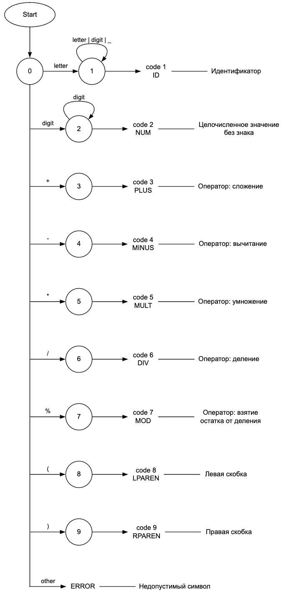

## Пример корректного лексического анализа

Исходная строка:

```text
a + 12 * (b - 3) % 5
```

Ожидаемый результат:

- все лексемы успешно распознаны;
- в таблице отображаются идентификаторы, числа, операторы и скобки;
- лексические ошибки отсутствуют.

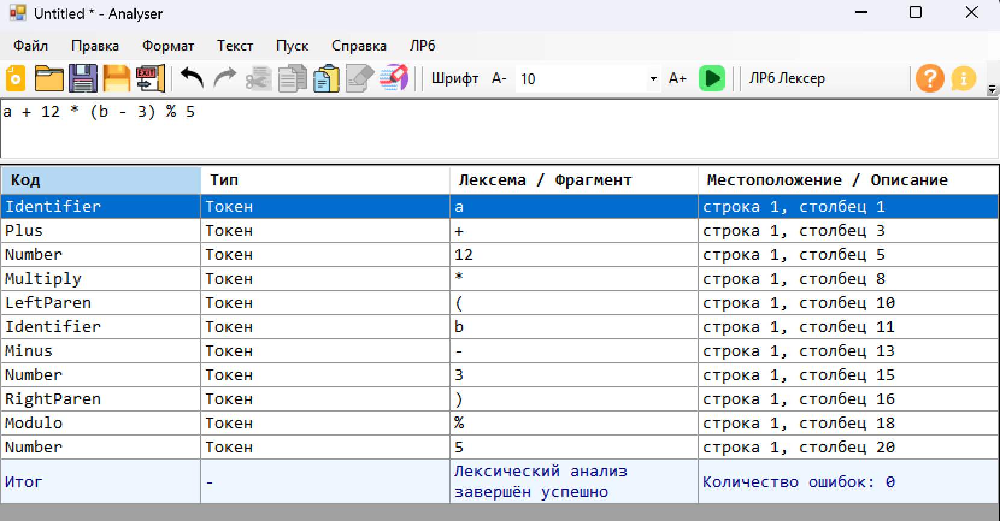

## Пример лексической ошибки

Исходная строка:

```text
12 + @
```

Ожидаемый результат:

- символ `@` не входит в алфавит допустимых символов арифметического выражения;
- лексер формирует сообщение о недопустимом символе;
- синтаксический анализ, построение тетрад и построение ПОЛИЗ не выполняются.

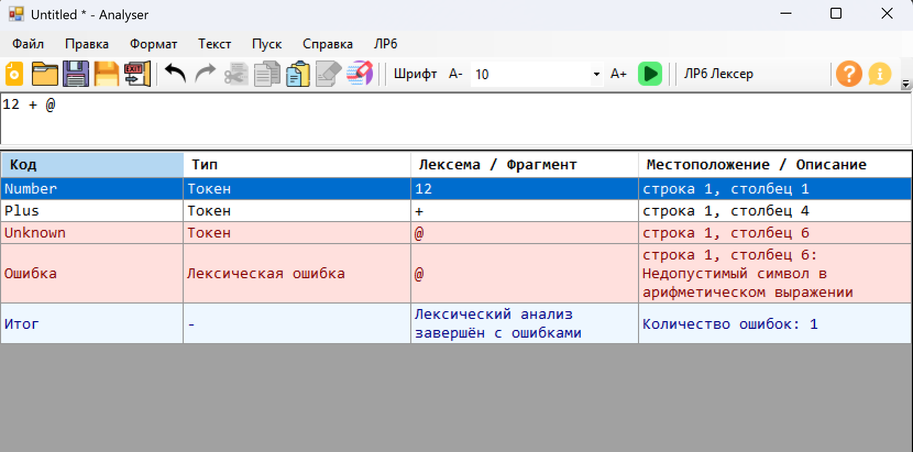

---

# Синтаксический анализ методом рекурсивного спуска

## Назначение парсера

Синтаксический анализатор проверяет, соответствует ли последовательность лексем заданной контекстно-свободной грамматике.

В программе реализован синтаксический анализ методом рекурсивного спуска. Для каждого нетерминала грамматики используется отдельный метод:

| Нетерминал | Метод |
|---|---|
| `E` | `ParseE()` |
| `A` | `ParseA()` |
| `T` | `ParseT()` |
| `B` | `ParseB()` |
| `F` | `ParseF()` |

Общий порядок анализа:

1. Выполняется лексический анализ входной строки.
2. Если лексических ошибок нет, запускается синтаксический анализ.
3. Разбор начинается с начального нетерминала `E`.
4. Если выражение корректно, формируется внутреннее дерево выражения.
5. Если обнаружены ошибки, они выводятся в таблицу результатов.

## Схема рекурсивного спуска

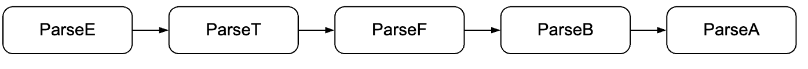

## Пример корректного синтаксического анализа

Исходная строка:

```text
(12 + 5) % 3
```

Ожидаемый результат:

- лексический анализ завершается успешно;
- синтаксический анализ завершается успешно;
- выражение соответствует грамматике;
- построение тетрад и ПОЛИЗ разрешено.

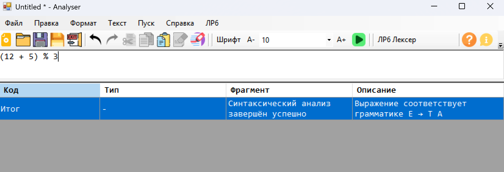

## Пример синтаксической ошибки: пропущен операнд

Исходная строка:

```text
12 + * 5
```

Ожидаемый результат:

- лексический анализ завершается успешно;
- синтаксический анализ обнаруживает ошибку;
- после оператора `+` ожидался операнд;
- построение тетрад и ПОЛИЗ не выполняется.

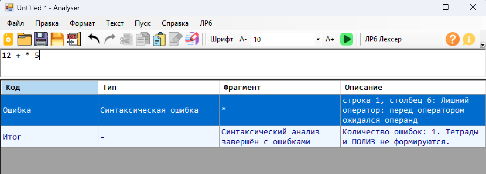

## Пример синтаксической ошибки: пропущена закрывающая скобка

Исходная строка:

```text
(12 + 5
```

Ожидаемый результат:

- лексический анализ завершается успешно;
- синтаксический анализ обнаруживает отсутствие закрывающей скобки `)`;
- построение тетрад и ПОЛИЗ не выполняется.

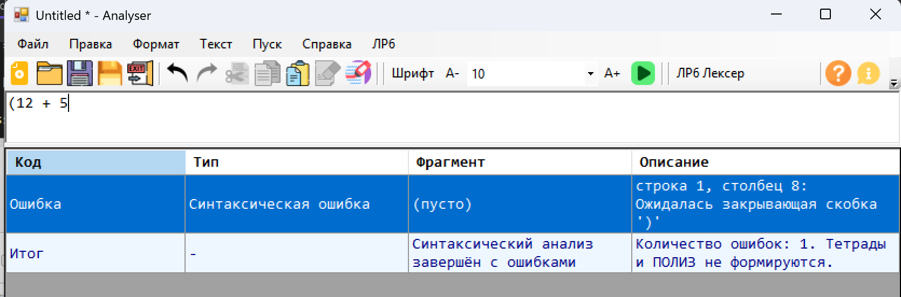

## Пример синтаксической ошибки: лишняя закрывающая скобка

Исходная строка:

```text
12 + )
```

Ожидаемый результат:

- лексический анализ завершается успешно;
- синтаксический анализ обнаруживает лишнюю закрывающую скобку или отсутствие операнда перед ней;
- построение тетрад и ПОЛИЗ не выполняется.

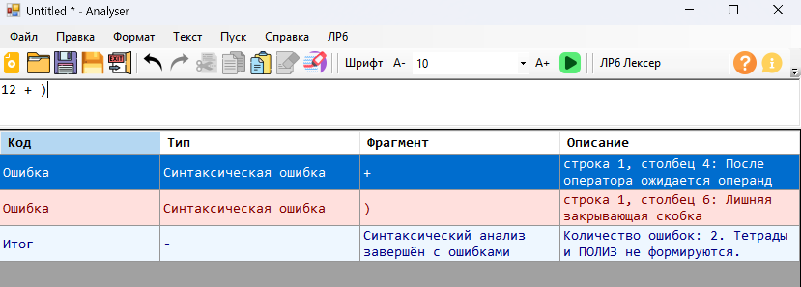

---

# Внутренняя форма представления программы: тетрады

## Назначение тетрад

Тетрады используются как внутренняя форма представления арифметического выражения.

Каждая тетрада имеет вид:

```text
(op, arg1, arg2, result)
```

где:

- `op` — операция;
- `arg1` — первый операнд;
- `arg2` — второй операнд;
- `result` — временная переменная, в которую помещается результат операции.

В программе временные переменные имеют вид:

```text
t1, t2, t3, ...
```

Тетрады строятся только для корректных выражений, в которых отсутствуют лексические и синтаксические ошибки.

## Пример построения тетрад для выражения из целых чисел

Исходная строка:

```text
(12 + 5) % 3
```

Ожидаемая последовательность тетрад:

```text
(+, 12, 5, t1)
(%, t1, 3, t2)
```

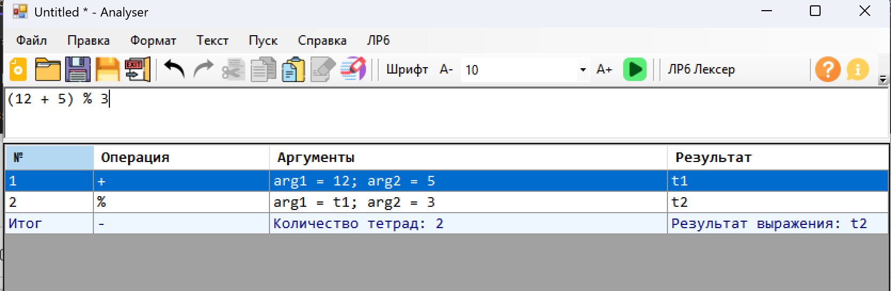

## Пример построения тетрад для выражения с идентификаторами

Исходная строка:

```text
a + b * c
```

Ожидаемая последовательность тетрад:

```text
(*, b, c, t1)
(+, a, t1, t2)
```

Данный пример показывает, что тетрады могут быть построены для корректного арифметического выражения с идентификаторами.

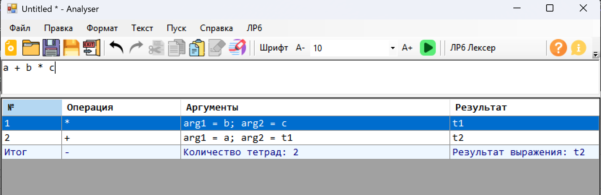

## Пример запрета построения тетрад при ошибке

Исходная строка:

```text
12 + * 5
```

Ожидаемый результат:

- синтаксический анализ обнаруживает ошибку;
- таблица тетрад не формируется;
- пользователю выводится предупреждение о невозможности построения внутреннего представления.

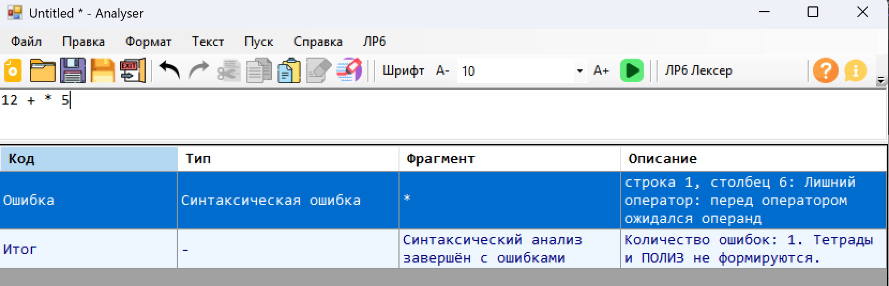

---

# ПОЛИЗ

## Назначение ПОЛИЗ

ПОЛИЗ — польская инверсная запись, в которой операция записывается после своих операндов.

Например, инфиксное выражение:

```text
12 + 5
```

в ПОЛИЗ записывается как:

```text
12 5 +
```

В программе ПОЛИЗ формируется только для корректных арифметических выражений, состоящих исключительно из целых чисел.

Если выражение содержит идентификаторы, вычисление невозможно, так как значения переменных неизвестны.

## Пример построения ПОЛИЗ и вычисления выражения

Исходная строка:

```text
(12 + 5) % 3
```

Построенная ПОЛИЗ:

```text
12 5 + 3 %
```

Пошаговое вычисление:

```text
12 5 + 3 %

1. 12 помещается в стек: [12]
2. 5 помещается в стек: [12, 5]
3. выполняется операция 12 + 5 = 17: [17]
4. 3 помещается в стек: [17, 3]
5. выполняется операция 17 % 3 = 2: [2]
```

Результат вычисления:

```text
2
```

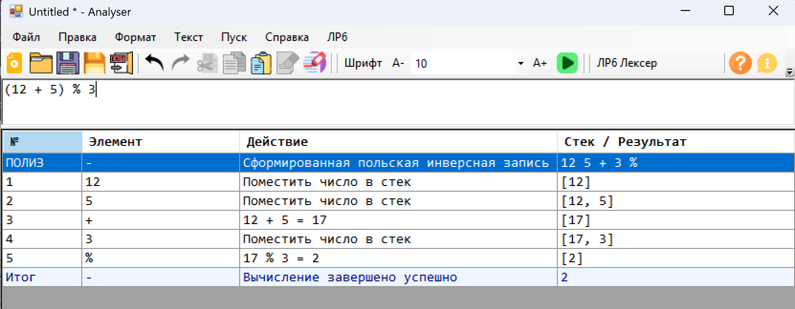

## Пример вычисления с приоритетом операций

Исходная строка:

```text
12 + 5 * 3
```

Построенная ПОЛИЗ:

```text
12 5 3 * +
```

Результат вычисления:

```text
27
```

Данный пример подтверждает, что операции `*`, `/`, `%` имеют более высокий приоритет, чем операции `+` и `-`.

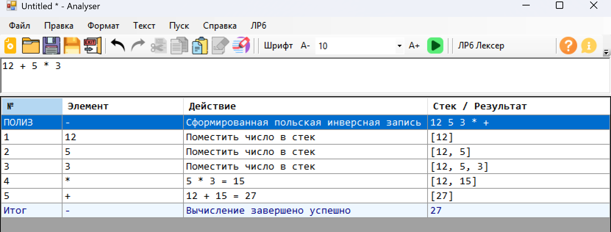

## Пример запрета ПОЛИЗ для выражения с идентификатором

Исходная строка:

```text
a + 5
```

Ожидаемый результат:

- лексический анализ завершается успешно;
- синтаксический анализ завершается успешно;
- выражение корректно с точки зрения грамматики;
- ПОЛИЗ и вычисление не выполняются, так как по заданию ПОЛИЗ формируется только для выражений из целых чисел.

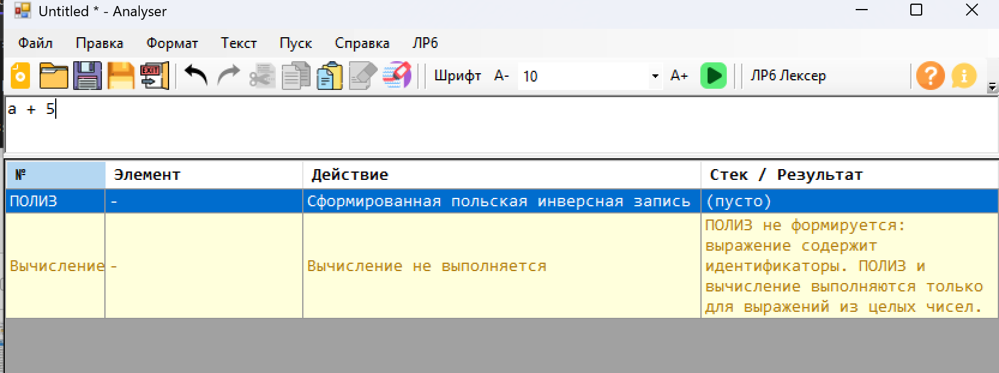

## Пример ошибки вычисления: деление на ноль

Исходная строка:

```text
12 / (3 - 3)
```

Построенная ПОЛИЗ:

```text
12 3 3 - /
```

При вычислении выражения возникает деление на ноль.

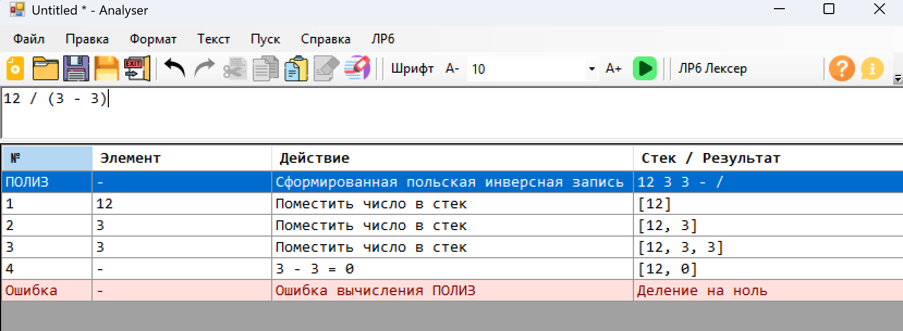

---

# Тестовые примеры

## Корректные выражения

| № | Входная строка | Ожидаемый результат |
|---|---|---|
| 1 | `12 + 5` | успешный разбор, тетрада сложения, ПОЛИЗ `12 5 +`, результат `17` |
| 2 | `12 + 5 * 3` | успешный разбор с учётом приоритета, результат `27` |
| 3 | `(12 + 5) % 3` | успешный разбор, результат `2` |
| 4 | `a + b * c` | успешный разбор, построение тетрад, ПОЛИЗ не вычисляется |
| 5 | `(x + 10) / y` | успешный разбор, построение тетрад, ПОЛИЗ не вычисляется |

## Ошибочные выражения

| № | Входная строка | Ожидаемый результат |
|---|---|---|
| 1 | `12 + @` | лексическая ошибка: недопустимый символ |
| 2 | `12 + * 5` | синтаксическая ошибка: после оператора ожидался операнд |
| 3 | `(12 + 5` | синтаксическая ошибка: ожидалась закрывающая скобка |
| 4 | `12 + )` | синтаксическая ошибка: отсутствует операнд перед закрывающей скобкой |
| 5 | `12 5` | синтаксическая ошибка: отсутствует оператор между операндами |
| 6 | `()` | синтаксическая ошибка: в скобках отсутствует выражение |

---

# Вывод

В ходе лабораторной работы был реализован модуль обработки арифметических выражений для языка Kotlin.

Выполнены следующие задачи:

1. Разработан лексический анализатор для выделения идентификаторов, целых чисел, арифметических операторов и скобок.
2. Реализован синтаксический анализатор методом рекурсивного спуска по заданной контекстно-свободной грамматике.
3. Добавлена диагностика лексических и синтаксических ошибок.
4. Реализовано построение внутренней формы представления выражения в виде тетрад `(op, arg1, arg2, result)`.
5. Реализовано построение ПОЛИЗ для корректных выражений из целых чисел.
6. Реализовано вычисление ПОЛИЗ с использованием стека.
7. Добавлена защита от построения тетрад и ПОЛИЗ при наличии ошибок во входной строке.
