сщву# Лабораторная работа 7. Анализ и преобразование кода с использованием Clang и LLVM

## Цель работы.

Познакомиться с инструментарием Clang и LLVM, освоить получение абстрактного синтаксического дерева (AST) и промежуточного представления (LLVM IR) для кода на C/C++, научиться применять базовые оптимизации, строить графы потока управления (CFG), а также анализировать влияние оптимизаций на различные синтаксические конструкции языка.

## Автор

**Костоломов Александр Евгеньевич**.

Группа: **АВТ-314**.

## Постановка задачи.
1. Установить Clang и LLVM;
2. Скомпилировать простой C-файл с использованием clang и получить его: абстрактное синтаксическое дерево (AST), промежуточное представление LLVM IR;
3. Использовать opt для применения базовой комплексной оптимизации (например, О2);
4. Построить граф потока управления (CFG) для оптимизированной программы;
5. Проанализировать результат, сделать выводы и ответить на контрольные вопросы.
6. Выполнить индивидуальное задание в соответствии со своим оператором из КР / РГР.
---
### Индивидуальное задание
Тема: Списки / массивы / словари
```cpp
//Пример кода:
#include <iostream>
#include <array>
int main() {
std::array<int, 5> data = {1, 2, 3, 4, 5};
int sum = 0;
for (int i = 0; i < data.size(); ++i) {
sum += data[i];
}
std::cout << sum << std::endl;
return 0;
}
```
Задания:
1. Получите IR для -O0 и -O2.
2. Исследуйте, разворачивается ли цикл (-unroll).
3. Постройте CFG для main с -O0 и с -O2.
4. Примените дополнительно -loop-rotate, -licm и опишите
изменения.
5. Вывод: какие оптимизации применились к массиву и циклу?

## Общее задание

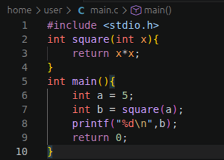

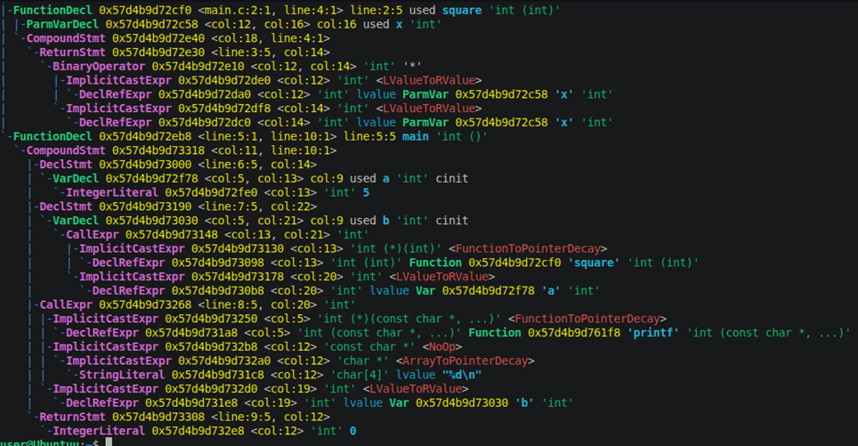

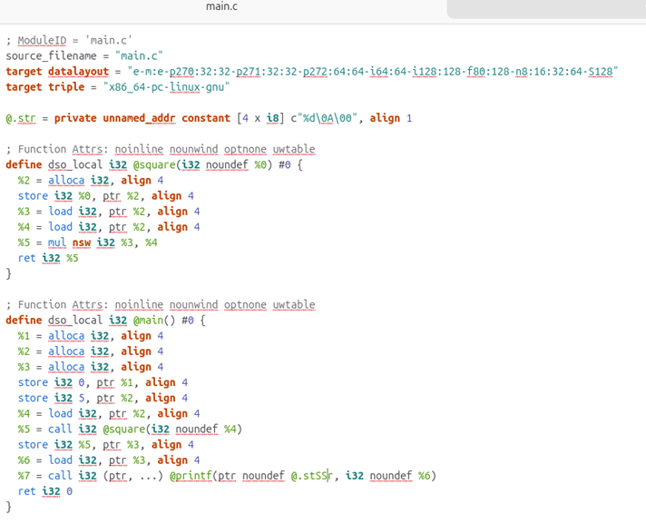

### Листинг LLVM IR

```llvm
; ModuleID = 'main.c'
source_filename = "main.c"
target datalayout = "e-m:e-p270:32:32-p271:32:32-p272:64:64-i64:64-i128:128-f80:128-n8:16:32:64-S128"
target triple = "x86_64-pc-linux-gnu"

@.str = private unnamed_addr constant [4 x i8] c"%d\0A\00", align 1

; Function Attrs: noinline nounwind optnone uwtable
define dso_local i32 @square(i32 noundef %0) #0 {
  %2 = alloca i32, align 4
  store i32 %0, ptr %2, align 4
  %3 = load i32, ptr %2, align 4
  %4 = load i32, ptr %2, align 4
  %5 = mul nsw i32 %3, %4
  ret i32 %5
}

; Function Attrs: noinline nounwind optnone uwtable
define dso_local i32 @main() #0 {
  %1 = alloca i32, align 4
  %2 = alloca i32, align 4
  %3 = alloca i32, align 4
  store i32 0, ptr %1, align 4
  store i32 5, ptr %2, align 4
  %4 = load i32, ptr %2, align 4
  %5 = call i32 @square(i32 noundef %4)
  store i32 %5, ptr %3, align 4
  %6 = load i32, ptr %3, align 4
  %7 = call i32 (ptr, ...) @printf(ptr noundef @.str, i32 noundef %6)
  ret i32 0
}

declare i32 @printf(ptr noundef, ...) #1

attributes #0 = { noinline nounwind optnone uwtable "frame-pointer"="all" "min-legal-vector-width"="0" "no-trapping-math"="true" "stack-protector-buffer-size"="8" "target-cpu"="x86-64" "target-features"="+cmov,+cx8,+fxsr,+mmx,+sse,+sse2,+x87" "tune-cpu"="generic" }
attributes #1 = { "frame-pointer"="all" "no-trapping-math"="true" "stack-protector-buffer-size"="8" "target-cpu"="x86-64" "target-features"="+cmov,+cx8,+fxsr,+mmx,+sse,+sse2,+x87" "tune-cpu"="generic" }

!llvm.module.flags = !{!0, !1, !2, !3, !4}
!llvm.ident = !{!5}

!0 = !{i32 1, !"wchar_size", i32 4}
!1 = !{i32 8, !"PIC Level", i32 2}
!2 = !{i32 7, !"PIE Level", i32 2}
!3 = !{i32 7, !"uwtable", i32 2}
!4 = !{i32 7, !"frame-pointer", i32 2}
!5 = !{!"Ubuntu clang version 21.1.8 (6ubuntu1)"}
```

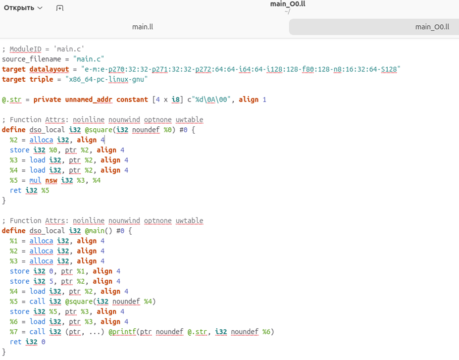

### LLVM IR без оптимизаций (-O0)

```llvm
; ModuleID = 'main.c'
source_filename = "main.c"
target datalayout = "e-m:e-p270:32:32-p271:32:32-p272:64:64-i64:64-i128:128-f80:128-n8:16:32:64-S128"
target triple = "x86_64-pc-linux-gnu"

@.str = private unnamed_addr constant [4 x i8] c"%d\0A\00", align 1

; Function Attrs: noinline nounwind optnone uwtable
define dso_local i32 @square(i32 noundef %0) #0 {
  %2 = alloca i32, align 4
  store i32 %0, ptr %2, align 4
  %3 = load i32, ptr %2, align 4
  %4 = load i32, ptr %2, align 4
  %5 = mul nsw i32 %3, %4
  ret i32 %5
}

; Function Attrs: noinline nounwind optnone uwtable
define dso_local i32 @main() #0 {
  %1 = alloca i32, align 4
  %2 = alloca i32, align 4
  %3 = alloca i32, align 4
  store i32 0, ptr %1, align 4
  store i32 5, ptr %2, align 4
  %4 = load i32, ptr %2, align 4
  %5 = call i32 @square(i32 noundef %4)
  store i32 %5, ptr %3, align 4
  %6 = load i32, ptr %3, align 4
  %7 = call i32 (ptr, ...) @printf(ptr noundef @.str, i32 noundef %6)
  ret i32 0
}

declare i32 @printf(ptr noundef, ...) #1

attributes #0 = { noinline nounwind optnone uwtable "frame-pointer"="all" "min-legal-vector-width"="0" "no-trapping-math"="true" "stack-protector-buffer-size"="8" "target-cpu"="x86-64" "target-features"="+cmov,+cx8,+fxsr,+mmx,+sse,+sse2,+x87" "tune-cpu"="generic" }
attributes #1 = { "frame-pointer"="all" "no-trapping-math"="true" "stack-protector-buffer-size"="8" "target-cpu"="x86-64" "target-features"="+cmov,+cx8,+fxsr,+mmx,+sse,+sse2,+x87" "tune-cpu"="generic" }

!llvm.module.flags = !{!0, !1, !2, !3, !4}
!llvm.ident = !{!5}

!0 = !{i32 1, !"wchar_size", i32 4}
!1 = !{i32 8, !"PIC Level", i32 2}
!2 = !{i32 7, !"PIE Level", i32 2}
!3 = !{i32 7, !"uwtable", i32 2}
!4 = !{i32 7, !"frame-pointer", i32 2}
!5 = !{!"Ubuntu clang version 21.1.8 (6ubuntu1)"}
```

    
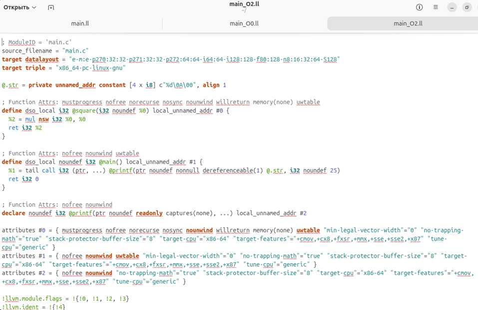

### Комплексная оптимизация среднего уровня IR

```llvm
; ModuleID = 'main.c'
source_filename = "main.c"
target datalayout = "e-m:e-p270:32:32-p271:32:32-p272:64:64-i64:64-i128:128-f80:128-n8:16:32:64-S128"
target triple = "x86_64-pc-linux-gnu"

@.str = private unnamed_addr constant [4 x i8] c"%d\0A\00", align 1

; Function Attrs: mustprogress nofree norecurse nosync nounwind willreturn memory(none) uwtable
define dso_local i32 @square(i32 noundef %0) local_unnamed_addr #0 {
  %2 = mul nsw i32 %0, %0
  ret i32 %2
}

; Function Attrs: nofree nounwind uwtable
define dso_local noundef i32 @main() local_unnamed_addr #1 {
  %1 = tail call i32 (ptr, ...) @printf(ptr noundef nonnull dereferenceable(1) @.str, i32 noundef 25)
  ret i32 0
}

; Function Attrs: nofree nounwind
declare noundef i32 @printf(ptr noundef readonly captures(none), ...) local_unnamed_addr #2

attributes #0 = { mustprogress nofree norecurse nosync nounwind willreturn memory(none) uwtable "min-legal-vector-width"="0" "no-trapping-math"="true" "stack-protector-buffer-size"="8" "target-cpu"="x86-64" "target-features"="+cmov,+cx8,+fxsr,+mmx,+sse,+sse2,+x87" "tune-cpu"="generic" }
attributes #1 = { nofree nounwind uwtable "min-legal-vector-width"="0" "no-trapping-math"="true" "stack-protector-buffer-size"="8" "target-cpu"="x86-64" "target-features"="+cmov,+cx8,+fxsr,+mmx,+sse,+sse2,+x87" "tune-cpu"="generic" }
attributes #2 = { nofree nounwind "no-trapping-math"="true" "stack-protector-buffer-size"="8" "target-cpu"="x86-64" "target-features"="+cmov,+cx8,+fxsr,+mmx,+sse,+sse2,+x87" "tune-cpu"="generic" }

!llvm.module.flags = !{!0, !1, !2, !3}
!llvm.ident = !{!4}

!0 = !{i32 1, !"wchar_size", i32 4}
!1 = !{i32 8, !"PIC Level", i32 2}
!2 = !{i32 7, !"PIE Level", i32 2}
!3 = !{i32 7, !"uwtable", i32 2}
!4 = !{!"Ubuntu clang version 21.1.8 (6ubuntu1)"}
```


5. Сравненение оптимизаций
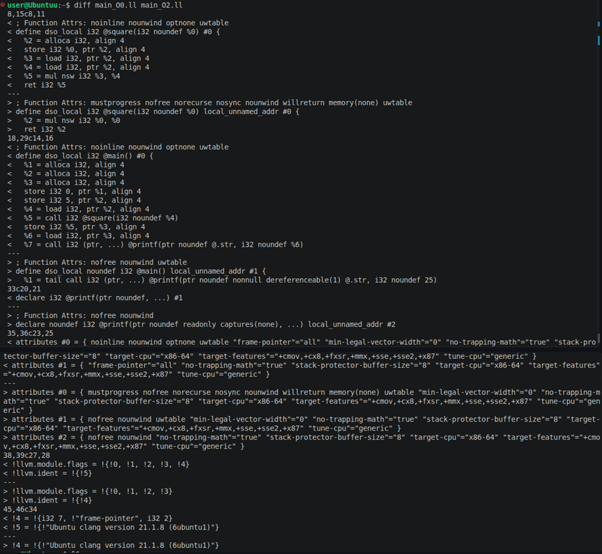

Изменения после оптимизации:
- Переменные типа alloca были удалены;
- Код переведён в SSA-форму;
- Оптимизация улучшила читаемость и упростила поток управления.

6. Построение CFG для оптимизированного LLVM IR
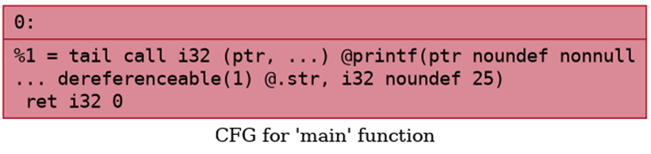
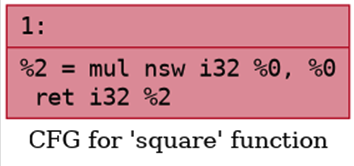

## Индивидуальное задание

1. Исходный код
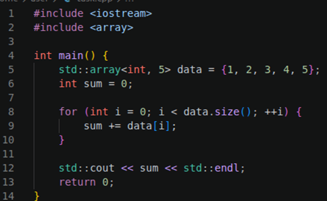

2. Оптимизация IR
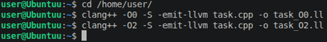

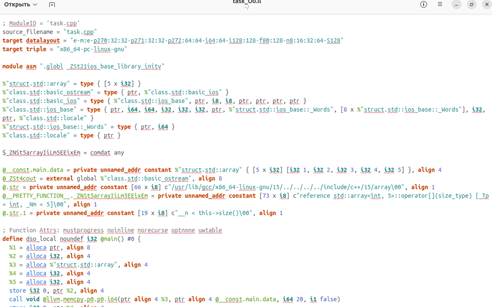

### Листинг нулевой оптимизации IR

```llvm
; ModuleID = 'task.cpp'
source_filename = "task.cpp"
target datalayout = "e-m:e-p270:32:32-p271:32:32-p272:64:64-i64:64-i128:128-f80:128-n8:16:32:64-S128"
target triple = "x86_64-pc-linux-gnu"

module asm ".globl _ZSt21ios_base_library_initv"

%"struct.std::array" = type { [5 x i32] }
%"class.std::basic_ostream" = type { ptr, %"class.std::basic_ios" }
%"class.std::basic_ios" = type { %"class.std::ios_base", ptr, i8, i8, ptr, ptr, ptr, ptr }
%"class.std::ios_base" = type { ptr, i64, i64, i32, i32, i32, ptr, %"struct.std::ios_base::_Words", [8 x %"struct.std::ios_base::_Words"], i32, ptr, %"class.std::locale" }
%"struct.std::ios_base::_Words" = type { ptr, i64 }
%"class.std::locale" = type { ptr }

$_ZNSt5arrayIiLm5EEixEm = comdat any

@__const.main.data = private unnamed_addr constant %"struct.std::array" { [5 x i32] [i32 1, i32 2, i32 3, i32 4, i32 5] }, align 4
@_ZSt4cout = external global %"class.std::basic_ostream", align 8
@.str = private unnamed_addr constant [66 x i8] c"/usr/lib/gcc/x86_64-linux-gnu/15/../../../../include/c++/15/array\00", align 1
@__PRETTY_FUNCTION__._ZNSt5arrayIiLm5EEixEm = private unnamed_addr constant [73 x i8] c"reference std::array<int, 5>::operator[](size_type) [_Tp = int, _Nm = 5]\00", align 1
@.str.1 = private unnamed_addr constant [19 x i8] c"__n < this->size()\00", align 1

; Function Attrs: mustprogress noinline norecurse optnone uwtable
define dso_local noundef i32 @main() #0 {
  %1 = alloca ptr, align 8
  %2 = alloca i32, align 4
  %3 = alloca %"struct.std::array", align 4
  %4 = alloca i32, align 4
  %5 = alloca i32, align 4
  store i32 0, ptr %2, align 4
  call void @llvm.memcpy.p0.p0.i64(ptr align 4 %3, ptr align 4 @__const.main.data, i64 20, i1 false)
  store i32 0, ptr %4, align 4
  store i32 0, ptr %5, align 4
  br label %6

6:                                                ; preds = %18, %0
  %7 = load i32, ptr %5, align 4
  %8 = sext i32 %7 to i64
  store ptr %3, ptr %1, align 8
  %9 = load ptr, ptr %1, align 8
  %10 = icmp ult i64 %8, 5
  br i1 %10, label %11, label %21

11:                                               ; preds = %6
  %12 = load i32, ptr %5, align 4
  %13 = sext i32 %12 to i64
  %14 = call noundef nonnull align 4 dereferenceable(4) ptr @_ZNSt5arrayIiLm5EEixEm(ptr noundef nonnull align 4 dereferenceable(20) %3, i64 noundef %13) #5
  %15 = load i32, ptr %14, align 4
  %16 = load i32, ptr %4, align 4
  %17 = add nsw i32 %16, %15
  store i32 %17, ptr %4, align 4
  br label %18

18:                                               ; preds = %11
  %19 = load i32, ptr %5, align 4
  %20 = add nsw i32 %19, 1
  store i32 %20, ptr %5, align 4
  br label %6, !llvm.loop !6

21:                                               ; preds = %6
  %22 = load i32, ptr %4, align 4
  %23 = call noundef nonnull align 8 dereferenceable(8) ptr @_ZNSolsEi(ptr noundef nonnull align 8 dereferenceable(8) @_ZSt4cout, i32 noundef %22)
  %24 = call noundef nonnull align 8 dereferenceable(8) ptr @_ZNSolsEPFRSoS_E(ptr noundef nonnull align 8 dereferenceable(8) %23, ptr noundef @_ZSt4endlIcSt11char_traitsIcEERSt13basic_ostreamIT_T0_ES6_)
  ret i32 0
}

; Function Attrs: nocallback nofree nounwind willreturn memory(argmem: readwrite)
declare void @llvm.memcpy.p0.p0.i64(ptr noalias writeonly captures(none), ptr noalias readonly captures(none), i64, i1 immarg) #1

; Function Attrs: mustprogress noinline nounwind optnone uwtable
define linkonce_odr dso_local noundef nonnull align 4 dereferenceable(4) ptr @_ZNSt5arrayIiLm5EEixEm(ptr noundef nonnull align 4 dereferenceable(20) %0, i64 noundef %1) #2 comdat align 2 {
  %3 = alloca ptr, align 8
  %4 = alloca ptr, align 8
  %5 = alloca i64, align 8
  store ptr %0, ptr %4, align 8
  store i64 %1, ptr %5, align 8
  %6 = load ptr, ptr %4, align 8
  br label %7

7:                                                ; preds = %2
  %8 = load i64, ptr %5, align 8
  store ptr %6, ptr %3, align 8
  %9 = load ptr, ptr %3, align 8
  %10 = icmp ult i64 %8, 5
  %11 = xor i1 %10, true
  br i1 %11, label %12, label %13

12:                                               ; preds = %7
  call void @_ZSt21__glibcxx_assert_failPKciS0_S0_(ptr noundef @.str, i32 noundef 210, ptr noundef @__PRETTY_FUNCTION__._ZNSt5arrayIiLm5EEixEm, ptr noundef @.str.1) #6
  unreachable

13:                                               ; preds = %7
  br label %14

14:                                               ; preds = %13
  br label %15

15:                                               ; preds = %14
  %16 = getelementptr inbounds nuw %"struct.std::array", ptr %6, i32 0, i32 0
  %17 = load i64, ptr %5, align 8
  %18 = getelementptr inbounds nuw [5 x i32], ptr %16, i64 0, i64 %17
  ret ptr %18
}

declare noundef nonnull align 8 dereferenceable(8) ptr @_ZNSolsEi(ptr noundef nonnull align 8 dereferenceable(8), i32 noundef) #3

declare noundef nonnull align 8 dereferenceable(8) ptr @_ZNSolsEPFRSoS_E(ptr noundef nonnull align 8 dereferenceable(8), ptr noundef) #3

declare noundef nonnull align 8 dereferenceable(8) ptr @_ZSt4endlIcSt11char_traitsIcEERSt13basic_ostreamIT_T0_ES6_(ptr noundef nonnull align 8 dereferenceable(8)) #3

; Function Attrs: cold noreturn nounwind
declare void @_ZSt21__glibcxx_assert_failPKciS0_S0_(ptr noundef, i32 noundef, ptr noundef, ptr noundef) #4

attributes #0 = { mustprogress noinline norecurse optnone uwtable "frame-pointer"="all" "min-legal-vector-width"="0" "no-trapping-math"="true" "stack-protector-buffer-size"="8" "target-cpu"="x86-64" "target-features"="+cmov,+cx8,+fxsr,+mmx,+sse,+sse2,+x87" "tune-cpu"="generic" }
attributes #1 = { nocallback nofree nounwind willreturn memory(argmem: readwrite) }
attributes #2 = { mustprogress noinline nounwind optnone uwtable "frame-pointer"="all" "min-legal-vector-width"="0" "no-trapping-math"="true" "stack-protector-buffer-size"="8" "target-cpu"="x86-64" "target-features"="+cmov,+cx8,+fxsr,+mmx,+sse,+sse2,+x87" "tune-cpu"="generic" }
attributes #3 = { "frame-pointer"="all" "no-trapping-math"="true" "stack-protector-buffer-size"="8" "target-cpu"="x86-64" "target-features"="+cmov,+cx8,+fxsr,+mmx,+sse,+sse2,+x87" "tune-cpu"="generic" }
attributes #4 = { cold noreturn nounwind "frame-pointer"="all" "no-trapping-math"="true" "stack-protector-buffer-size"="8" "target-cpu"="x86-64" "target-features"="+cmov,+cx8,+fxsr,+mmx,+sse,+sse2,+x87" "tune-cpu"="generic" }
attributes #5 = { nounwind }
attributes #6 = { cold noreturn nounwind }

!llvm.module.flags = !{!0, !1, !2, !3, !4}
!llvm.ident = !{!5}

!0 = !{i32 1, !"wchar_size", i32 4}
!1 = !{i32 8, !"PIC Level", i32 2}
!2 = !{i32 7, !"PIE Level", i32 2}
!3 = !{i32 7, !"uwtable", i32 2}
!4 = !{i32 7, !"frame-pointer", i32 2}
!5 = !{!"Ubuntu clang version 21.1.8 (6ubuntu1)"}
!6 = distinct !{!6, !7}
!7 = !{!"llvm.loop.mustprogress"}
```

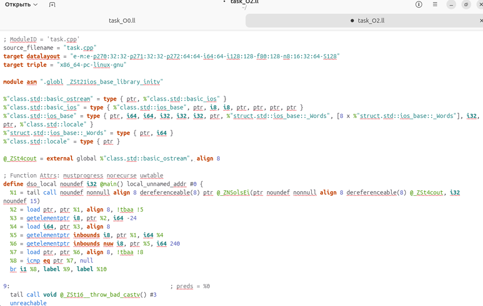

### Листинг комплексной оптимизации среднего уровня IR

```llvm
; ModuleID = 'task.cpp'
source_filename = "task.cpp"
target datalayout = "e-m:e-p270:32:32-p271:32:32-p272:64:64-i64:64-i128:128-f80:128-n8:16:32:64-S128"
target triple = "x86_64-pc-linux-gnu"

module asm ".globl _ZSt21ios_base_library_initv"

%"class.std::basic_ostream" = type { ptr, %"class.std::basic_ios" }
%"class.std::basic_ios" = type { %"class.std::ios_base", ptr, i8, i8, ptr, ptr, ptr, ptr }
%"class.std::ios_base" = type { ptr, i64, i64, i32, i32, i32, ptr, %"struct.std::ios_base::_Words", [8 x %"struct.std::ios_base::_Words"], i32, ptr, %"class.std::locale" }
%"struct.std::ios_base::_Words" = type { ptr, i64 }
%"class.std::locale" = type { ptr }

@_ZSt4cout = external global %"class.std::basic_ostream", align 8

; Function Attrs: mustprogress norecurse uwtable
define dso_local noundef i32 @main() local_unnamed_addr #0 {
  %1 = tail call noundef nonnull align 8 dereferenceable(8) ptr @_ZNSolsEi(ptr noundef nonnull align 8 dereferenceable(8) @_ZSt4cout, i32 noundef 15)
  %2 = load ptr, ptr %1, align 8, !tbaa !5
  %3 = getelementptr i8, ptr %2, i64 -24
  %4 = load i64, ptr %3, align 8
  %5 = getelementptr inbounds i8, ptr %1, i64 %4
  %6 = getelementptr inbounds nuw i8, ptr %5, i64 240
  %7 = load ptr, ptr %6, align 8, !tbaa !8
  %8 = icmp eq ptr %7, null
  br i1 %8, label %9, label %10

9:                                                ; preds = %0
  tail call void @_ZSt16__throw_bad_castv() #3
  unreachable

10:                                               ; preds = %0
  %11 = getelementptr inbounds nuw i8, ptr %7, i64 56
  %12 = load i8, ptr %11, align 8, !tbaa !28
  %13 = icmp eq i8 %12, 0
  br i1 %13, label %17, label %14

14:                                               ; preds = %10
  %15 = getelementptr inbounds nuw i8, ptr %7, i64 67
  %16 = load i8, ptr %15, align 1, !tbaa !34
  br label %22

17:                                               ; preds = %10
  tail call void @_ZNKSt5ctypeIcE13_M_widen_initEv(ptr noundef nonnull align 8 dereferenceable(570) %7)
  %18 = load ptr, ptr %7, align 8, !tbaa !5
  %19 = getelementptr inbounds nuw i8, ptr %18, i64 48
  %20 = load ptr, ptr %19, align 8
  %21 = tail call noundef signext i8 %20(ptr noundef nonnull align 8 dereferenceable(570) %7, i8 noundef signext 10)
  br label %22

22:                                               ; preds = %14, %17
  %23 = phi i8 [ %16, %14 ], [ %21, %17 ]
  %24 = tail call noundef nonnull align 8 dereferenceable(8) ptr @_ZNSo3putEc(ptr noundef nonnull align 8 dereferenceable(8) %1, i8 noundef signext %23)
  %25 = tail call noundef nonnull align 8 dereferenceable(8) ptr @_ZNSo5flushEv(ptr noundef nonnull align 8 dereferenceable(8) %24)
  ret i32 0
}

declare noundef nonnull align 8 dereferenceable(8) ptr @_ZNSolsEi(ptr noundef nonnull align 8 dereferenceable(8), i32 noundef) local_unnamed_addr #1

declare noundef nonnull align 8 dereferenceable(8) ptr @_ZNSo3putEc(ptr noundef nonnull align 8 dereferenceable(8), i8 noundef signext) local_unnamed_addr #1

declare noundef nonnull align 8 dereferenceable(8) ptr @_ZNSo5flushEv(ptr noundef nonnull align 8 dereferenceable(8)) local_unnamed_addr #1

; Function Attrs: cold noreturn
declare void @_ZSt16__throw_bad_castv() local_unnamed_addr #2

declare void @_ZNKSt5ctypeIcE13_M_widen_initEv(ptr noundef nonnull align 8 dereferenceable(570)) local_unnamed_addr #1

attributes #0 = { mustprogress norecurse uwtable "min-legal-vector-width"="0" "no-trapping-math"="true" "stack-protector-buffer-size"="8" "target-cpu"="x86-64" "target-features"="+cmov,+cx8,+fxsr,+mmx,+sse,+sse2,+x87" "tune-cpu"="generic" }
attributes #1 = { "no-trapping-math"="true" "stack-protector-buffer-size"="8" "target-cpu"="x86-64" "target-features"="+cmov,+cx8,+fxsr,+mmx,+sse,+sse2,+x87" "tune-cpu"="generic" }
attributes #2 = { cold noreturn "no-trapping-math"="true" "stack-protector-buffer-size"="8" "target-cpu"="x86-64" "target-features"="+cmov,+cx8,+fxsr,+mmx,+sse,+sse2,+x87" "tune-cpu"="generic" }
attributes #3 = { cold noreturn }

!llvm.module.flags = !{!0, !1, !2, !3}
!llvm.ident = !{!4}

!0 = !{i32 1, !"wchar_size", i32 4}
!1 = !{i32 8, !"PIC Level", i32 2}
!2 = !{i32 7, !"PIE Level", i32 2}
!3 = !{i32 7, !"uwtable", i32 2}
!4 = !{!"Ubuntu clang version 21.1.8 (6ubuntu1)"}
!5 = !{!6, !6, i64 0}
!6 = !{!"vtable pointer", !7, i64 0}
!7 = !{!"Simple C++ TBAA"}
!8 = !{!9, !25, i64 240}
!9 = !{!"_ZTSSt9basic_iosIcSt11char_traitsIcEE", !10, i64 0, !22, i64 216, !12, i64 224, !23, i64 225, !24, i64 232, !25, i64 240, !26, i64 248, !27, i64 256}
!10 = !{!"_ZTSSt8ios_base", !11, i64 8, !11, i64 16, !13, i64 24, !14, i64 28, !14, i64 32, !15, i64 40, !17, i64 48, !12, i64 64, !18, i64 192, !19, i64 200, !20, i64 208}
!11 = !{!"long", !12, i64 0}
!12 = !{!"omnipotent char", !7, i64 0}
!13 = !{!"_ZTSSt13_Ios_Fmtflags", !12, i64 0}
!14 = !{!"_ZTSSt12_Ios_Iostate", !12, i64 0}
!15 = !{!"p1 _ZTSNSt8ios_base14_Callback_listE", !16, i64 0}
!16 = !{!"any pointer", !12, i64 0}
!17 = !{!"_ZTSNSt8ios_base6_WordsE", !16, i64 0, !11, i64 8}
!18 = !{!"int", !12, i64 0}
!19 = !{!"p1 _ZTSNSt8ios_base6_WordsE", !16, i64 0}
!20 = !{!"_ZTSSt6locale", !21, i64 0}
!21 = !{!"p1 _ZTSNSt6locale5_ImplE", !16, i64 0}
!22 = !{!"p1 _ZTSSo", !16, i64 0}
!23 = !{!"bool", !12, i64 0}
!24 = !{!"p1 _ZTSSt15basic_streambufIcSt11char_traitsIcEE", !16, i64 0}
!25 = !{!"p1 _ZTSSt5ctypeIcE", !16, i64 0}
!26 = !{!"p1 _ZTSSt7num_putIcSt19ostreambuf_iteratorIcSt11char_traitsIcEEE", !16, i64 0}
!27 = !{!"p1 _ZTSSt7num_getIcSt19istreambuf_iteratorIcSt11char_traitsIcEEE", !16, i64 0}
!28 = !{!29, !12, i64 56}
!29 = !{!"_ZTSSt5ctypeIcE", !30, i64 0, !31, i64 16, !23, i64 24, !32, i64 32, !32, i64 40, !33, i64 48, !12, i64 56, !12, i64 57, !12, i64 313, !12, i64 569}
!30 = !{!"_ZTSNSt6locale5facetE", !18, i64 8}
!31 = !{!"p1 _ZTS15__locale_struct", !16, i64 0}
!32 = !{!"p1 int", !16, i64 0}
!33 = !{!"p1 short", !16, i64 0}
!34 = !{!12, !12, i64 0}
```


3. Исследование разворачивается ли цикл (-unroll)

> [!NOTE]
> При нулевой оптимизации вычислительный цикл присутствует в явном виде. Внутри базового блока @main() чётко прослеживается стандартная циклическая структура. На уровне -O2 произошла полная развёртка и удаление цикла на этапе компиляции, вычислив результат итераций статически во время компиляции. 

4. Построение CFG для main с -O0 и с -O2

-O0

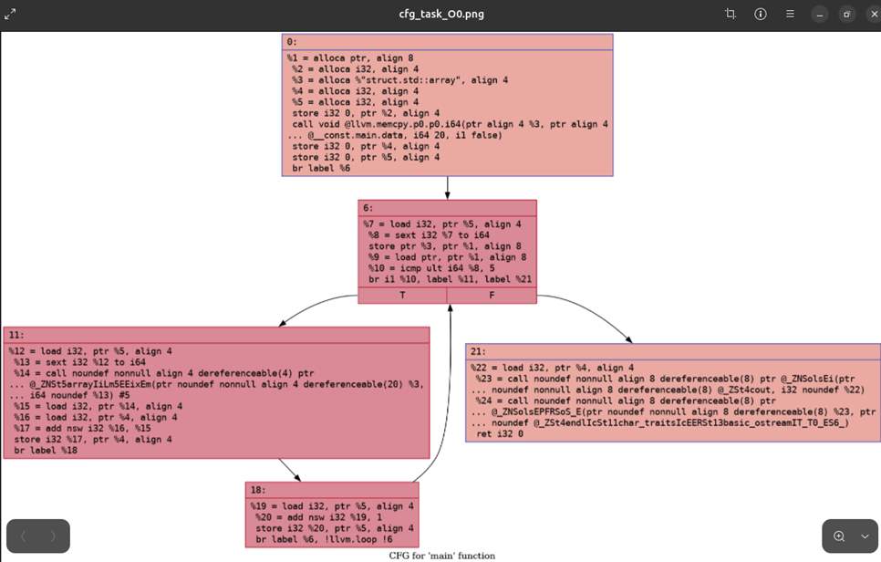

-O2

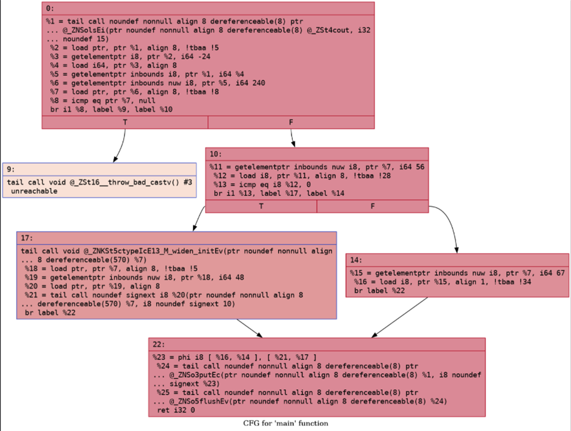

 Присутствующие на графе разветвления и блоки относятся к обеспечению работы std::endl и системной локали стандартной библиотеки STL

5. Применение дополнительно -loop-rotate, -licm и описание изменений

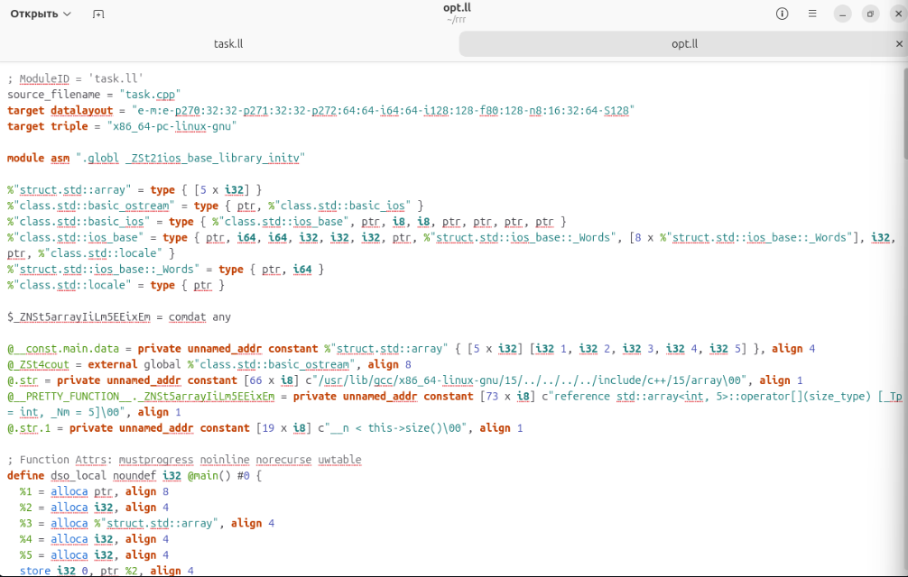

### Листинг дополнительных оптимизаций

```llvm
; ModuleID = 'task.ll'
source_filename = "task.cpp"
target datalayout = "e-m:e-p270:32:32-p271:32:32-p272:64:64-i64:64-i128:128-f80:128-n8:16:32:64-S128"
target triple = "x86_64-pc-linux-gnu"

module asm ".globl _ZSt21ios_base_library_initv"

%"struct.std::array" = type { [5 x i32] }
%"class.std::basic_ostream" = type { ptr, %"class.std::basic_ios" }
%"class.std::basic_ios" = type { %"class.std::ios_base", ptr, i8, i8, ptr, ptr, ptr, ptr }
%"class.std::ios_base" = type { ptr, i64, i64, i32, i32, i32, ptr, %"struct.std::ios_base::_Words", [8 x %"struct.std::ios_base::_Words"], i32, ptr, %"class.std::locale" }
%"struct.std::ios_base::_Words" = type { ptr, i64 }
%"class.std::locale" = type { ptr }

$_ZNSt5arrayIiLm5EEixEm = comdat any

@__const.main.data = private unnamed_addr constant %"struct.std::array" { [5 x i32] [i32 1, i32 2, i32 3, i32 4, i32 5] }, align 4
@_ZSt4cout = external global %"class.std::basic_ostream", align 8
@.str = private unnamed_addr constant [66 x i8] c"/usr/lib/gcc/x86_64-linux-gnu/15/../../../../include/c++/15/array\00", align 1
@__PRETTY_FUNCTION__._ZNSt5arrayIiLm5EEixEm = private unnamed_addr constant [73 x i8] c"reference std::array<int, 5>::operator[](size_type) [_Tp = int, _Nm = 5]\00", align 1
@.str.1 = private unnamed_addr constant [19 x i8] c"__n < this->size()\00", align 1

; Function Attrs: mustprogress noinline norecurse uwtable
define dso_local noundef i32 @main() #0 {
  %1 = alloca ptr, align 8
  %2 = alloca i32, align 4
  %3 = alloca %"struct.std::array", align 4
  %4 = alloca i32, align 4
  %5 = alloca i32, align 4
  store i32 0, ptr %2, align 4
  call void @llvm.memcpy.p0.p0.i64(ptr align 4 %3, ptr align 4 @__const.main.data, i64 20, i1 false)
  store i32 0, ptr %4, align 4
  store i32 0, ptr %5, align 4
  %6 = load i32, ptr %5, align 4
  %7 = sext i32 %6 to i64
  store ptr %3, ptr %1, align 8
  %8 = load ptr, ptr %1, align 8
  %9 = icmp ult i64 %7, 5
  br i1 %9, label %.lr.ph, label %21

.lr.ph:                                           ; preds = %0
  %.promoted = load i32, ptr %5, align 4
  %.promoted1 = load i32, ptr %4, align 4
  br label %10

10:                                               ; preds = %.lr.ph, %17
  %11 = phi i32 [ %.promoted1, %.lr.ph ], [ %16, %17 ]
  %12 = phi i32 [ %.promoted, %.lr.ph ], [ %18, %17 ]
  %13 = sext i32 %12 to i64
  %14 = call noundef nonnull align 4 dereferenceable(4) ptr @_ZNSt5arrayIiLm5EEixEm(ptr noundef nonnull align 4 dereferenceable(20) %3, i64 noundef %13) #5
  %15 = load i32, ptr %14, align 4
  %16 = add nsw i32 %11, %15
  br label %17

17:                                               ; preds = %10
  %18 = add nsw i32 %12, 1
  %19 = sext i32 %18 to i64
  %20 = icmp ult i64 %19, 5
  br i1 %20, label %10, label %._crit_edge, !llvm.loop !6

._crit_edge:                                      ; preds = %17
  %.lcssa2 = phi i32 [ %16, %17 ]
  %.lcssa = phi i32 [ %18, %17 ]
  store i32 %.lcssa, ptr %5, align 4
  store i32 %.lcssa2, ptr %4, align 4
  store ptr %3, ptr %1, align 1
  br label %21

21:                                               ; preds = %._crit_edge, %0
  %22 = load i32, ptr %4, align 4
  %23 = call noundef nonnull align 8 dereferenceable(8) ptr @_ZNSolsEi(ptr noundef nonnull align 8 dereferenceable(8) @_ZSt4cout, i32 noundef %22)
  %24 = call noundef nonnull align 8 dereferenceable(8) ptr @_ZNSolsEPFRSoS_E(ptr noundef nonnull align 8 dereferenceable(8) %23, ptr noundef @_ZSt4endlIcSt11char_traitsIcEERSt13basic_ostreamIT_T0_ES6_)
  ret i32 0
}

; Function Attrs: nocallback nofree nounwind willreturn memory(argmem: readwrite)
declare void @llvm.memcpy.p0.p0.i64(ptr noalias writeonly captures(none), ptr noalias readonly captures(none), i64, i1 immarg) #1

; Function Attrs: mustprogress noinline nounwind uwtable
define linkonce_odr dso_local noundef nonnull align 4 dereferenceable(4) ptr @_ZNSt5arrayIiLm5EEixEm(ptr noundef nonnull align 4 dereferenceable(20) %0, i64 noundef %1) #2 comdat align 2 {
  %3 = alloca ptr, align 8
  %4 = alloca ptr, align 8
  %5 = alloca i64, align 8
  store ptr %0, ptr %4, align 8
  store i64 %1, ptr %5, align 8
  %6 = load ptr, ptr %4, align 8
  br label %7

7:                                                ; preds = %2
  %8 = load i64, ptr %5, align 8
  store ptr %6, ptr %3, align 8
  %9 = load ptr, ptr %3, align 8
  %10 = icmp ult i64 %8, 5
  %11 = xor i1 %10, true
  br i1 %11, label %12, label %13

12:                                               ; preds = %7
  call void @_ZSt21__glibcxx_assert_failPKciS0_S0_(ptr noundef @.str, i32 noundef 210, ptr noundef @__PRETTY_FUNCTION__._ZNSt5arrayIiLm5EEixEm, ptr noundef @.str.1) #6
  unreachable

13:                                               ; preds = %7
  br label %14

14:                                               ; preds = %13
  br label %15

15:                                               ; preds = %14
  %16 = getelementptr inbounds nuw %"struct.std::array", ptr %6, i32 0, i32 0
  %17 = load i64, ptr %5, align 8
  %18 = getelementptr inbounds nuw [5 x i32], ptr %16, i64 0, i64 %17
  ret ptr %18
}

declare noundef nonnull align 8 dereferenceable(8) ptr @_ZNSolsEi(ptr noundef nonnull align 8 dereferenceable(8), i32 noundef) #3

declare noundef nonnull align 8 dereferenceable(8) ptr @_ZNSolsEPFRSoS_E(ptr noundef nonnull align 8 dereferenceable(8), ptr noundef) #3

declare noundef nonnull align 8 dereferenceable(8) ptr @_ZSt4endlIcSt11char_traitsIcEERSt13basic_ostreamIT_T0_ES6_(ptr noundef nonnull align 8 dereferenceable(8)) #3

; Function Attrs: cold noreturn nounwind
declare void @_ZSt21__glibcxx_assert_failPKciS0_S0_(ptr noundef, i32 noundef, ptr noundef, ptr noundef) #4

attributes #0 = { mustprogress noinline norecurse uwtable "frame-pointer"="all" "min-legal-vector-width"="0" "no-trapping-math"="true" "stack-protector-buffer-size"="8" "target-cpu"="x86-64" "target-features"="+cmov,+cx8,+fxsr,+mmx,+sse,+sse2,+x87" "tune-cpu"="generic" }
attributes #1 = { nocallback nofree nounwind willreturn memory(argmem: readwrite) }
attributes #2 = { mustprogress noinline nounwind uwtable "frame-pointer"="all" "min-legal-vector-width"="0" "no-trapping-math"="true" "stack-protector-buffer-size"="8" "target-cpu"="x86-64" "target-features"="+cmov,+cx8,+fxsr,+mmx,+sse,+sse2,+x87" "tune-cpu"="generic" }
attributes #3 = { "frame-pointer"="all" "no-trapping-math"="true" "stack-protector-buffer-size"="8" "target-cpu"="x86-64" "target-features"="+cmov,+cx8,+fxsr,+mmx,+sse,+sse2,+x87" "tune-cpu"="generic" }
attributes #4 = { cold noreturn nounwind "frame-pointer"="all" "no-trapping-math"="true" "stack-protector-buffer-size"="8" "target-cpu"="x86-64" "target-features"="+cmov,+cx8,+fxsr,+mmx,+sse,+sse2,+x87" "tune-cpu"="generic" }
attributes #5 = { nounwind }
attributes #6 = { cold noreturn nounwind }

!llvm.module.flags = !{!0, !1, !2, !3, !4}
!llvm.ident = !{!5}

!0 = !{i32 1, !"wchar_size", i32 4}
!1 = !{i32 8, !"PIC Level", i32 2}
!2 = !{i32 7, !"PIE Level", i32 2}
!3 = !{i32 7, !"uwtable", i32 2}
!4 = !{i32 7, !"frame-pointer", i32 2}
!5 = !{!"Ubuntu clang version 21.1.8 (6ubuntu1)"}
!6 = distinct !{!6, !7}
!7 = !{!"llvm.loop.mustprogress"}
```


> [!NOTE]
> -loop-rotate,licm производят оптимизацию структуры цикла.
> Оптимизация -loop-rotate поменяла структуру самого цикла. Цикл for превратился в цикл типа do-while (проверка в самом конце). Также избавилась от одного лишнего прыжка (br) на каждом круге цикла.
Оптимизация -licm вынесла из тела цикла операции со стеком (многократное повторение) и поместила их в предзаголовок цикла (один раз до входа в цикл).

6. Вывод

> [!NOTE]
> При оптимизации -O2 цикл и массив были полностью удалены, значение 15 было вычислено на этапе компиляции и подставлено напрямую в блок вывода.

## Контрольные вопросы
1. Что такое Clang, и какова его роль в процессе компиляции программ?
> фронтенд компилятора для языков семейства C, созданный на базе инфраструктуры LLVM. Роль - трансляция исходного кода в понятное для компилятора промежуточное представление.
2. Что представляет собой LLVM и как он используется в современных компиляторах?
> универсальная модульная инфраструктура для разработки компиляторов (оптимизации) и анализа кода. В современных компиляторах выступает в роли мидлфронта (оптимизация) и бэкенда (превращение в машинный код).
3. Чем отличается абстрактное синтаксическое дерево (AST) от промежуточного представления LLVM IR?
> AST - высокоуровневое, древовидное представление программы, используется для семантического анализа.  LLVM IR - низкоуровневое линейное представление, напоминающее универсальный ассемблер для гипотетического процессора с бесконечным числом виртуальных регистров, нужен для оптимизаций.
4. Для чего необходимо промежуточное представление (IR) в процессе компиляции?
> Для независимости от языков и процессоров, а также для проведения оптимизаций
5. Что делает инструкция alloc в LLVM IR, и зачем она используется в функциях?
> Выделяет память на стеке, используется для локальных переменных.
6. Зачем нужна оптимизация кода в компиляторе, и какие основные цели она преследует?
> Для повышения быстродействия, уменьшения размера кода.
7. Что такое SSA-форма и почему она важна при оптимизации программ?
> SSA (Static Single Assignment - статическое единичное присваивание) — свойство промежуточного представления, при котором каждая переменная должна быть определена до ее использования и получить значение ровно один раз.
8. Что такое граф потока управления (CFG) и как он помогает анализировать поведение программы?
> CFG — граф потока управления программы, где вершины — базовые блоки, рёбра — возможные переходы выполнения. Помогает анализировать циклы, ветвления.
8. Как устроено представление арифметических операций в LLVM IR (например, умножение, сложение)?
> По принципу ТАС: у операции есть строго один оператор, два операнда и один результат.
10. Почему функции в LLVM IR обычно представляют собой отдельные единицы анализа и оптимизации?
> Разделение на отдельные единицы позволяет распараллеливать компиляцию, экономить оперативную память компилятора и применять кэширование результатов.
11. Что происходит с функцией в LLVM IR, если она вызывается один раз и очень короткая?
> Происходит инлайнинг. Компилятор удалит сам вызов функции, а её тело перенесет прямо в место вызова, подставив аргументы вместо параметров.
12. Какие преимущества даёт использование IR и CFG для автоматических оптимизаций по сравнению с анализом исходного текста на C?
> Явные зависимости, строгая типизация и простота инструкций

---

## Дополнительное задание

### Вариант

Выбранная синтаксическая конструкция соответствует варианту курсовой работы:

**Объявление списка с инициализацией на языке Kotlin.**

Корректная строка:

```kotlin
val nums = listOf(+001, -0, 2.5000, "Dog");
```

Для данной конструкции в проекте реализованы:

1. построение абстрактного синтаксического дерева (AST);
2. генерация промежуточного представления IR;
3. две локальные оптимизации IR;
4. демонстрация исходного и оптимизированного IR в GUI.

> Важно: оптимизации выполняются именно для выбранной конструкции `val ... = listOf(...)`.  
> Для списка нельзя удалять повторяющиеся элементы и нельзя сортировать элементы, так как это изменит семантику списка: порядок и количество элементов имеют значение.

---

### Тестовый пример

Для демонстрации работы дополнительного задания используется строка:

```kotlin
val nums = listOf(+001, -0, 2.5000, "Dog");
```

После выполнения анализа в GUI становится доступна кнопка:

```text
IR и оптимизации
```

При нажатии на кнопку открывается окно, в котором отображаются:

- AST конструкции;
- исходный IR;
- результат локальной оптимизации №1;
- служебный словарь для локальной оптимизации №2;
- результат локальной оптимизации №2;
- итоговый вывод о выполнении дополнительного задания.

**Рисунок — демонстрация работы IR и оптимизаций в GUI:**

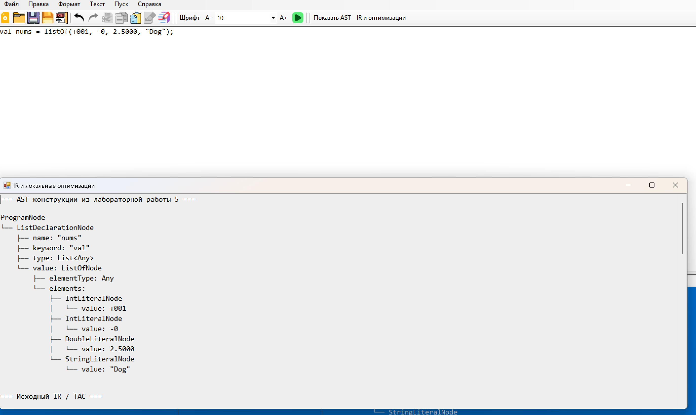

---

### Абстрактное синтаксическое дерево

Для входной строки:

```kotlin
val nums = listOf(+001, -0, 2.5000, "Dog");
```

строится абстрактное синтаксическое дерево, отражающее смысловую структуру объявления списка.

Упрощённое представление AST:

```text
Program
└── ListDeclaration
    ├── Identifier: nums
    └── ListOf
        └── Elements
            ├── Literal: +001
            ├── Literal: -0
            ├── Literal: 2.5000
            └── Literal: "Dog"
```

AST содержит только значимые для дальнейшего анализа элементы конструкции. Служебные токены `val`, `=`, `listOf`, скобки, запятые и точка с запятой используются при синтаксическом анализе, но не являются самостоятельными смысловыми узлами дерева.

**Рисунок — AST для тестового примера:**

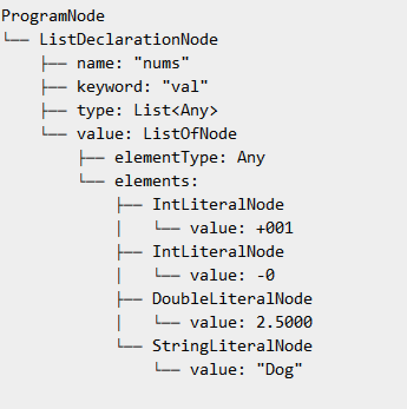

---

### Промежуточное представление IR

После построения AST выполняется генерация промежуточного представления.

В работе используется упрощённое IR в виде списка виртуальных инструкций, близкого к трёхадресному коду. Для элементов списка создаются временные переменные, затем формируется инструкция создания списка и инструкция присваивания результата идентификатору.

Исходный IR для строки:

```kotlin
val nums = listOf(+001, -0, 2.5000, "Dog");
```

имеет вид:

```text
t1 = const_int +001
t2 = const_int -0
t3 = const_double 2.5000
t4 = const_string "Dog"
t5 = listof t1, t2, t3, t4
nums = assign t5
```

Обозначения:

- `const_int` — загрузка целочисленной константы;
- `const_double` — загрузка вещественной константы;
- `const_string` — загрузка строковой константы;
- `listof` — формирование списка из элементов;
- `assign` — присваивание результата идентификатору;
- `t1`, `t2`, `t3`, `t4`, `t5` — временные переменные IR.

---

### Локальная оптимизация №1: нормализация числовых констант

Первая локальная оптимизация приводит числовые литералы к каноническому виду.

Оптимизация не изменяет значение константы, а только упрощает её запись.

Примеры преобразований:

```text
+001   -> 1
-0     -> 0
+0     -> 0
2.5000 -> 2.5
2,5000 -> 2.5
```

#### Вход оптимизации №1

```text
t1 = const_int +001
t2 = const_int -0
t3 = const_double 2.5000
t4 = const_string "Dog"
t5 = listof t1, t2, t3, t4
nums = assign t5
```

#### Выход оптимизации №1

```text
t1 = const_int 1
t2 = const_int 0
t3 = const_double 2.5
t4 = const_string "Dog"
t5 = listof t1, t2, t3, t4
nums = assign t5
```

Таким образом, IR становится более каноническим: разные формы записи одного и того же числового значения приводятся к единому виду.

**Рисунок — блок-схема локальной оптимизации №1:**

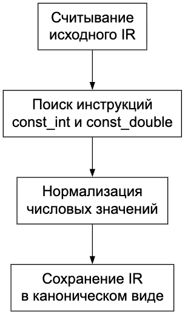

---

### Локальная оптимизация №2: встраивание литеральных временных переменных

Вторая локальная оптимизация выполняет встраивание временных переменных, которые содержат только литеральные значения и используются один раз при формировании списка.

Для этого используется словарь соответствий:

```text
temporary -> literal
```

Например:

```text
t1 -> 1
t2 -> 0
t3 -> 2.5
t4 -> "Dog"
```

После построения словаря оптимизатор заменяет временные переменные в инструкции `listof` на реальные литералы. Затем лишние инструкции `const_*`, которые больше не используются, удаляются.

#### Вход оптимизации №2

```text
t1 = const_int 1
t2 = const_int 0
t3 = const_double 2.5
t4 = const_string "Dog"
t5 = listof t1, t2, t3, t4
nums = assign t5
```

#### Служебный словарь оптимизации №2

```text
temporary -> literal
t1 -> 1
t2 -> 0
t3 -> 2.5
t4 -> "Dog"
```

#### Выход оптимизации №2

```text
t5 = listof 1, 0, 2.5, "Dog"
nums = assign t5
```

В результате IR становится проще: исчезают промежуточные инструкции загрузки литералов во временные переменные, а элементы списка напрямую указываются в инструкции `listof`.

**Рисунок — блок-схема локальной оптимизации №2:**

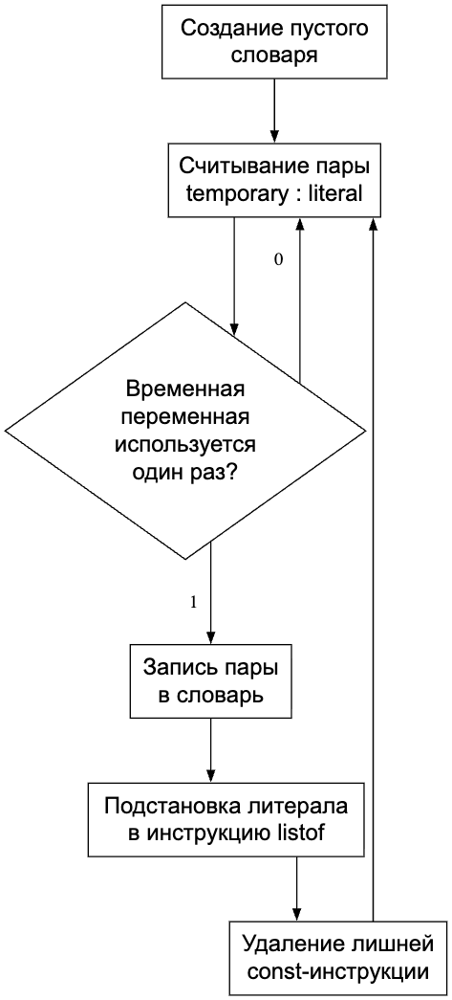

---

### Почему не используется удаление дубликатов

Для конструкции `listOf(...)` удаление повторяющихся элементов не является корректной оптимизацией.

Например:

```kotlin
val nums = listOf(1, 1, 2);
```

и

```kotlin
val nums = listOf(1, 2);
```

являются разными списками, потому что у них разная длина и разное расположение элементов.

Также нельзя сортировать элементы списка:

```kotlin
val nums = listOf(3, 1, 2);
```

и

```kotlin
val nums = listOf(1, 2, 3);
```

семантически неэквивалентны, так как порядок элементов списка имеет значение.

Поэтому в работе реализованы только безопасные локальные оптимизации, которые не изменяют содержимое списка и порядок его элементов.

Повторное объявление одного и того же идентификатора также не является задачей оптимизации IR. Такая ситуация обрабатывается на этапе семантического анализа как ошибка повторного объявления идентификатора через таблицу символов.

---

### Итоговая демонстрация

Для тестовой строки:

```kotlin
val nums = listOf(+001, -0, 2.5000, "Dog");
```

последовательность преобразования IR выглядит следующим образом.

#### Исходный IR

```text
t1 = const_int +001
t2 = const_int -0
t3 = const_double 2.5000
t4 = const_string "Dog"
t5 = listof t1, t2, t3, t4
nums = assign t5
```

#### После оптимизации №1

```text
t1 = const_int 1
t2 = const_int 0
t3 = const_double 2.5
t4 = const_string "Dog"
t5 = listof t1, t2, t3, t4
nums = assign t5
```

#### После оптимизации №2

```text
t5 = listof 1, 0, 2.5, "Dog"
nums = assign t5
```

**Рисунок — итоговый результат оптимизаций в GUI:**

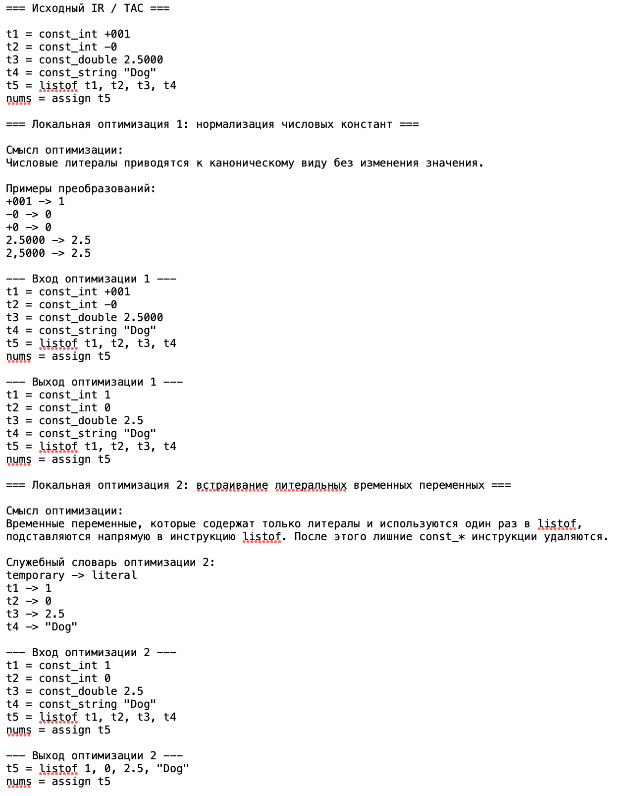

---

### Вывод

В ходе выполнения дополнительного задания для выбранной синтаксической конструкции было реализовано построение AST, генерация промежуточного представления IR и две локальные оптимизации.

Первая оптимизация приводит числовые константы к каноническому виду. Вторая оптимизация использует словарь временных переменных и встраивает литеральные значения напрямую в инструкцию формирования списка.

Обе оптимизации являются эквивалентными преобразованиями: они упрощают IR, но не изменяют семантику исходной конструкции `val ... = listOf(...)`.
